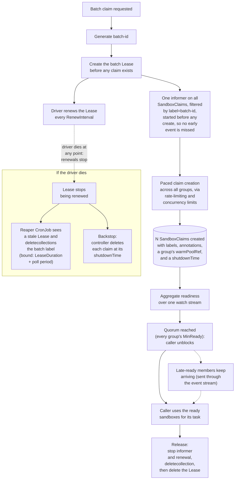

<!-- # KEP-NNNN: Sandbox Batch Claim API for SDK -->
# Sandbox Batch Claim API for SDK

## 1. Summary

This document (which may later be changed to a KEP) introduces to the SDKs `ClaimBatch`, a method that claims N `Sandboxes` as a single batch and returns a `Batch` handle for interacting with them, giving SDK users consistent, reliable, and efficient batch claiming instead of the duplicated fan-out, polling, and cleanup logic every task currently manually implements. A batch may span several `SandboxWarmPools`, since the sandboxes a single run needs are not always the same shape.

## 2. Motivation

Currently, work that involves claiming N `Sandboxes` as a batch, most notably in RL rollouts, a batch-eval harness, or our stress/benchmark tests, has to repeatedly and manually implement fan-out, polling, quorum, retry, and cleanup logic. Because the current SDK functions to claim `Sandboxes` were not designed with large scale claiming in mind, current efforts have suboptimal effects, such as (but not limited to):

- N watch connections for N claims
- A driver that dies partway through a fan-out leaks every claim it already created, until a user notices and cleans it up
- Readiness costs a watch stream per claim, and with the Python SDK in particular using HTTP/1.1, we have one TCP connection per claim, held open for the entire wait. These connections starve the client's connection pool, so at scale the create path stops reusing connections and dials a fresh one per claim.

## 3. Proposal

This proposal introduces `ClaimBatch`, a method that claims N sandboxes as a single batch and returns a `Batch` handle for interacting with them. These additions are meant to be made on the SDK layer only and do not touch the server/controller logic.

Goals:
- Support as a first-class feature in the SDKs. For Python, have async/sync parity and modify the `agent-sandbox-rl` library to use the feature instead.
- One call claims N Sandboxes with client-side pacing
- A batch spans one or more warm pools, so a run whose sandboxes are not all the same shape is still a single batch
- No per-claim watches established; instead, readiness is aggregated over a single watch stream corresponding to the batch
- A batch cannot outlive its driver unintentionally, including when the driver dies to `SIGKILL`, an OOM kill, or node preemption
- The Sandboxes in the batch can be used for a task as soon as a caller-specified quorum has been met

Non-goals:
- No server-side batch CRD and no controller changes
- No change to how a single sandbox is claimed
- No placement policy. A batch takes explicit per-pool sizes from the caller and never decides for itself how to spread a total across interchangeable pools.

## 4. Design

### 4.1 Batch Model

A batch organizes a set of claims around a singular batch id, and a shared cleanup path. It is composed of one or more `BatchGroups`, each naming a warmpool and how many `Sandboxes` to claim from it. Groups exist to allow for workloads which entail claiming many sandboxes across different images (e.g. eval harnesses).

A `Batch` has five core properties:
1. A randomly generated id with a leading letter so the id is a valid DNS label prefix for the Sandbox/Service names on a cold-started claim (a claim adopted from the warm pool keeps that Sandbox's own pre-generated name instead). The id is attached to each claim in the batch through the `agents.x-k8s.io/batch-id: <id>` label.
2. A deterministic name for each claim following the format `<batch-id>-<ordinal>`, so a retried create is idempotent. Ordinals come from one counter for the whole batch rather than one per group.
3. A `coordination.k8s.io/v1` Lease named `batch-<id>` in the same namespace as the claims, carrying the same batch-id label, which the driver renews while it is alive. Stale leases are later used for batch claim cleanup.
4. The annotations `agents.x-k8s.io/batch-size` and `agents.x-k8s.io/batch-groups` on the Lease, written once at create time to record the batch's original per-group sizes and minimum-ready counts so `GetBatch` can recover them without re-deriving them from the claims themselves.
5. All of a batch's claims live in one namespace. The controller only resolves a claim's warmPoolRef within the same namespace, and K namespace batch support would lead to K `deletecollection` calls instead of one, and messier RBAC.

`Batch` is designed as a handle following the same implemented pattern [KEP 359](../docs/keps/359-refactor-python-sdk/README.md) established for `Sandbox` in the Python SDK: obtained from a factory method (`ClaimBatch`/`GetBatch`), identified by a server-side id, re-attachable from a different process, and torn down by an explicit function (`Release`/`Detach`).

### 4.2 Batch Lifecycle

#### Paced Creation

Creation of claims is paced in two ways:
- A cap to how many creates start per second, to help avoid overwhelming the Kubernetes API server
- A cap to bound how many creates are in flight at once, so a slow server response doesn't exhaust connections or stall the client

Note that this is pacing only for the client; server-side is through `--sandbox-warm-pool-max-batch-size` and `--sandbox-claim-concurrent-workers`.

For the Go SDK, these caps are inert until the default QPS/Burst settings on `rest.Config` are overriden (otherwise, caps are bounded by min(default, cap)).

Similarly for the Python SDK, the bound is the shared `ApiClient`'s connection pool (`connection_pool_maxsize`, defaulting to `cpu_count() * 5`): an in-flight cap set above the pool size thrashes on new connections instead of queuing cleanly. There is currently no supported way to raise it; however, [#1509](https://github.com/kubernetes-sigs/agent-sandbox/pull/1509) will fix this by letting callers inject a pre-configured `ApiClient` with a larger pool.

#### Membership

Each claim in a batch is represented as a `Member` object carrying its claim/sandbox identity, its group, and its readiness. A `Member` doesn't carry a `Sandbox` object, but can be used to connect to and return one.

The members created by `ClaimBatch` are defined as the batch's initial fill. Initial-fill members can be replaced when done via `Replace`, which is a synchronous call that deletes the member and its claim, and returns a newly-created successor member and its claim to join the batch in its place.

Ordinals cannot be reused, as a replaced claim may still be terminating when its successor is created. Thus `<batch-id>-<ordinal>` uses a counter that increases monotonically over the batch's life.

#### Quorum

We return the batch for the caller to use once it has reached quorum, so the caller does not have to wait for every claim to suceed to perform work. Quorum is met when every group's initial fill has `MinReady` members `Ready` and is unreachable when some group's initial fill can no longer reach its `MinReady`.

To calculate quorum efficiently, we replace the existing behavior of having a watch per claim with a single watch (informer) on the `SandboxClaims` collection, scoped to the batch's namespace and batch's id label to aggregate readiness for each claim in the batch. One label covers every group, so adding groups adds no watches; the informer buckets each event by the claim's own `spec.warmPoolRef.name`.

`Ready` classifies as ready, pending, terminal, or lost. Terminal reasons are ones that never resolve on their own (i.e. not transient errors), and lost represents the claim being deleted from the batch (which is not ready or terminal). If for any group `size - terminalFailures - lost - createFailures < minReady`, quorum for that group is unreachable and `WaitForQuorum` returns immediately with the aggregated reasons.

When `ClaimBatch` meets quorum and returns, the stream keeps running and emits late `Ready` claims through a live `Events` channel for use. `Events` only carries members that were not handed to the caller synchronously (i.e. excluding returned quorum set and returned member from `Replace`).

`Events` closes when the initial fill "settles", which we define as no initial-fill member being able to still arrive (i.e. either ready, terminal or lost). This allows a caller write `for event in batch.events()` as its dispatch loop and finish as soon as the work is done.

#### Liveness

A `coordination.k8s.io/v1` Lease named `batch-<id>` is created before claim creation, and represents the batch's liveness state. While the driver is alive a background renewal loop (started automatically inside `ClaimBatch`) renews the Lease every `RenewInterval`.

If renewal itself starts failing while the driver is alive (writes throttled or erroring), we send a `LeaseDegraded` event, so the caller can checkpoint in-progress work or abort the batch.

We use the Lease in conjunction with a new stateless reaper process (likely running as a CronJob) that we introduce, which is responsible for deleting the claims of any batch whose Lease has gone stale.

#### Shutdown Backstop

We set `shutdownPolicy: Delete` and a `shutdownTime` on each claim, where `shutdownTime` represents the latest time that claim can exist. As a result, in event of liveness errors (e.g. a deadlocked main thread that still has the background thread renewing the Lease, crashed reaper CronJob), there is an additional mechanism for batch cleanup. This is not intended to be the primary cleanup mechanism and is therefore derived generously.

`shutdownTime` is computed per claim at that claim's own create time, as `created + QuorumTimeout + WorkBudget + margin`, rather than once for the batch. A replacement created an hour into a rolling run would otherwise inherit a deadline that has nearly passed, and would be deleted out from under the task it was just handed.

#### Cleanup

There are three ways a batch is cleaned up:

1. `Batch.Release()`, called explicitly or by the SDK's exit hooks, stops the informer and the renewal loop, makes a single call to the Kubernetes `deletecollection` API scoped to the batch's label, then deletes the Lease. As `deletecollection` is not atomic, `Release` re-lists by label and retries until the selector is empty.
2. Where the driver runs no code at all (`SIGKILL`, OOM kill, node preemption), the Lease is no longer renewed and the reaper issues the same label-scoped `deletecollection` to delete the claims, then delete the Lease.
3. The `shutdownTime` on the claim passes, and the claim is consequently deleted.

### 4.3 Batch Lifecycle Diagram

This diagram walks through how `ClaimBatch` builds and runs the `Batch` handle end to end:



### 4.4 RBAC

As a batch entails access to `deletecollection` for `SandboxClaims` and create/get/update/delete for `coordination.k8s.io` Leases, a Role will be needed to grant the driver further permissions to these.

The driver needs, in the batch's namespace:

```yaml
apiVersion: rbac.authorization.k8s.io/v1
kind: Role
metadata:
  name: sandbox-batch-driver
rules:
- apiGroups: ["extensions.agents.x-k8s.io"]
  resources: ["sandboxclaims"]
  verbs: ["create", "get", "list", "watch", "delete", "deletecollection"]
- apiGroups: ["coordination.k8s.io"]
  resources: ["leases"]
  verbs: ["create", "get", "update", "delete"]
```

Meanwhile, the reaper runs as a CronJob and needs, across the namespaces it is responsible for:

```yaml
apiVersion: rbac.authorization.k8s.io/v1
kind: ClusterRole
metadata:
  name: sandbox-batch-reaper
rules:
- apiGroups: ["coordination.k8s.io"]
  resources: ["leases"]
  verbs: ["get", "list", "watch", "delete"]
- apiGroups: ["extensions.agents.x-k8s.io"]
  resources: ["sandboxclaims"]
  verbs: ["list", "deletecollection"]
```

## 5. SDK API Additions

### 5.1 Core Batch Methods

- `claim_batch`: Create a new batch, returning a `Batch` handle
- `get_batch`: Return a batch handle (no create) of an existing batch by id, resuming lease renewal
- `wait_for_quorum`: Blocks until quorum is reached or not and returns either initial fill or error
- `connect(member)`: Returns a connected `Sandbox` (same return type as `Client.GetSandbox`) for interactive use. In contrast to `GetSandbox`, because information is already stored in `Member`, it skips the API calls to get the Sandbox and claim details and connects to the `Sandbox` directly.
- `replace(member)`: Deletes the member's claim and creates a successor in the same group under the same batch id. Blocks until the successor is Ready and returns it, and raises if the successor fails terminally
- `events`: A live channel of member transitions, closed once the initial fill settles
- Cleanup
    - `release`: Stop the informer and renewal, `deletecollection` the batch label, delete the Lease
    - `detach`: Stops the informer and renewal but leaves the claims alive for a later `get_batch`.
    - `release_not_ready`: Deletes only the members that never reached `Ready`

### 5.2 Python
Helper/supporting classes:
```python
class BatchGroup(BaseModel):
    """One warm-pool's share of a batch."""
    warmpool: str
    size: int
    min_ready: int | None = None                    # defaults to size

class BatchEventType(str, Enum):
    MEMBER_READY = "member_ready"
    MEMBER_LOST = "member_lost" 
    MEMBER_FAILED = "member_failed"
    LEASE_DEGRADED = "lease_degraded"

class Member(BaseModel):
    """One claim in a batch, with its identity, its group, and current readiness."""
    claim_name: str
    sandbox_name: str
    warmpool: str                                   # the group this member belongs to
    pod_ips: list[str] = []
    service_fqdn: str | None = None
    ready: bool = False
    terminal: bool = False
    lost: bool = False 
    reason: str | None = None
    message: str | None = None

class BatchEvent(BaseModel):
    """A member Ready transition, or a batch-level event carrying no member."""
    type: BatchEventType
    member: Member | None = None
```

Claim batch:
```python
# most optional args will have some default value later TBD
class AsyncSandboxClient:
    async def claim_batch(
        self,
        groups: Sequence[BatchGroup],               # one entry for a single-pool batch
        *,
        namespace: str = "default",
        labels: dict[str, str] | None = None,
        batch_id: str | None = None,                # to allow overrides

        # --- pacing and connection reuse ---
        create_qps: float | None = None,
        max_in_flight: int | None = None,

        # --- time ---
        work_budget: float | None = None,           # expected post-quorum working time
        quorum_timeout: float | None = None,
        lease_duration: float | None = None,
    ) -> "AsyncSandboxBatch": ...

    async def get_batch(
        self,
        batch_id: str,
        namespace: str = "default",
        *,
        adopt_expired: bool = False,                # re-create the Lease instead of failing
    ) -> "AsyncSandboxBatch": ...

# There will also be a SandboxClient claim_batch and get_batch with the same shape, just without async functions. 
```

Batch handle:
```python
class AsyncSandboxBatch:
    batch_id: str
    namespace: str
    groups: list[BatchGroup]
    size: int                                             # sum of the group sizes

    async def wait_for_quorum(self, timeout: float | None = None) -> list[Member]: ...
    def members(self, warmpool: str | None = None) -> list[Member]: ...   # current snapshot
    def events(self) -> AsyncIterator[BatchEvent]: ...
    def err(self) -> Exception | None: ...

    async def connect(self, member: Member) -> AsyncSandbox: ...
    async def replace(self, member: Member, timeout: float | None = None) -> Member: ...

    async def release(self) -> None: ...
    async def release_not_ready(self) -> None: ...
    async def detach(self, grace: float | None = None) -> None: ...

# There will also be a SandboxBatch variant which is similar to above, but uses Iterator over AsyncIterator, contains no async functions, and returns a Sandbox type for connect()
```

### 5.3 Go

The Go SDK mirrors the Python SDK additions, with the following differences:
- Extends the single client and adds a single `Batch` struct as there is no async/sync class differences
- `claim_batch`'s keyword arguments become a `BatchOptions` struct, with the groups in a required `Groups []BatchGroup` field.
- The event iterator becomes a receive-only channel

## 6. SDK Usage

### 6.1 Python

Examples use the async Python class, and the `SandboxClient`/`SandboxBatch` variant is the same code with `await` removed and `for` in place of `async for`.

#### Fixed cohort example

Claim a batch from one pool, start at quorum, release together.

```python
async with AsyncSandboxClient(connection_config=cfg) as client:
    batch = await client.claim_batch(
        [BatchGroup(warmpool="rollout-pool", size=200, min_ready=180)],
        work_budget=600,
    )
    try:
        ready = await batch.wait_for_quorum()
        await run_wave(batch, ready)
    finally:
        await batch.release()


async def run_wave(batch, ready):
    tasks = [asyncio.create_task(run_one(batch, m)) for m in ready]
    async for event in batch.events():          # late arrivals; ends when the batch settles
        if event.type is BatchEventType.MEMBER_READY:
            tasks.append(asyncio.create_task(run_one(batch, event.member)))
    await asyncio.gather(*tasks)
    if batch.err():                             # e.g. lease renewal stopped succeeding
        raise batch.err()


async def run_one(batch, member):
    sbx = await batch.connect(member)
    return await sbx.commands.run("python rollout.py")
```

#### Rolling, multi-pool example

Hold `size` members per group and swap each for a fresh one as its task finishes. Tasks are grouped by the pool that can run them, and each worker draws only from its own group's queue. `min_ready=1` starts each group as soon as it has one member, and the rest join through `events()`.

```python
pool = collections.defaultdict(list)
for t in tasks:
    pool[pool_for(t.image)].append(t)

batch = await client.claim_batch(
    groups=[BatchGroup(warmpool=p, size=min(len(ts), 40), min_ready=1)
            for p, ts in pool.items()],
    work_budget=3600,
)
try:
    pending, unrun = {p: asyncio.Queue() for p in pool}, []
    for p, ts in pool.items():
        for t in ts:
            pending[p].put_nowait(t)

    async def worker(member):
        first = True
        while True:
            try:
                task = pending[member.warmpool].get_nowait()
            except asyncio.QueueEmpty:
                return                          # no more work; member is left for release() to collect
            if not first:
                # Replace only with a task in hand, so the run never claims a trailing sandbox it will not use.
                try:
                    member = await batch.replace(member)   # same group, blocks until Ready
                except TerminalMemberError:
                    pending[member.warmpool].put_nowait(task)   # untried; a peer can run it
                    return                      # leave worker pool due to error
            first = False
            await run_task(task, await batch.connect(member))

    workers = [asyncio.create_task(worker(m)) for m in await batch.wait_for_quorum()]
    async for event in batch.events():          # remainder of the initial fill, all groups
        if event.type is BatchEventType.MEMBER_READY:
            workers.append(asyncio.create_task(worker(event.member)))
    await asyncio.gather(*workers)

    for p, q in pending.items():                # a group that lost every worker leaves work behind
        while not q.empty():
            unrun.append((p, q.get_nowait()))   # never attempted, not the same as failed
finally:
    await batch.release()
```

### 6.2 Go

Go's SDK usage shares the same structure as Python's usage above, but with some syntax differences due to language/library differences.

For fixed cohort, claim and cleanup:
```go
b, err := client.ClaimBatch(ctx, sandbox.BatchOptions{
    Groups:     []sandbox.BatchGroup{{WarmPool: "rollout-pool", Size: 200, MinReady: 180}},
    WorkBudget: 10 * time.Minute,
})
if err != nil {
    return err
}
defer b.Release(ctx)
```

From there `b.WaitForQuorum(ctx)` returns the ready members and dispatch is an `errgroup` over that slice, plus one goroutine ranging over `b.Events()` to pick up the rest of the initial fill.

For rolling mode, a worker ranges over its own group's channel, and the producer closes each channel once it is filled, where the Python loop instead exits on an empty queue.


### 6.3 Agent Sandbox RL

The user-facing code does not change:
```python
fleet = SandboxFleet(FleetConfig(clusters=[...], max_concurrent=40))
fleet.load_tasks(SweBenchSource(limit=200))
results = fleet.run(process_fn, strategy="pipelined", concurrency=40)
```

We change `process_parallel` in `strategies.py`, which is the executor every strategy calls to acquire, process, and release one sandbox per task, to split its `_one` helper. `_one`'s claim logic becomes a member drawn from a group, and the rest of it stays as it is.

Each call to the executor claims one batch, and since a strategy decides how many images a call covers, the batch's scope follows the strategy:
- `naive`: one batch for the run, covering every image
- `sliding` and `pipelined`: one batch per image window
- `run_none`: one batch per image

Before:
```python
# strategies.py currently: one claim, one watch and one delete per task, from `concurrency` independent worker threads
def process_parallel(fleet, tasks, process_fn, concurrency):
    results = [None] * len(tasks)

    def _one(task):
        handle = fleet.acquire(task)    # create + its own watch, blocks this worker
        fam, t0 = repo_family(task), time.monotonic()
        try:
            with fleet._obs.phase("process", cluster=handle.cluster_name, family=fam):
                return process_fn(task, handle)
        finally:
            fleet.release(handle)       # its own delete
            fleet._obs.task_done(...)   # per-task timing and ok/error status

    with ThreadPoolExecutor(max_workers=concurrency) as ex:
        futs = {ex.submit(_one, t): i for i, t in enumerate(tasks)}
        ...                             # results[i] = fut.result(), exception captured
    return results
```

After:

```python
# strategies.py after: one labelled set, one informer, one lease, one group per pool
def process_parallel(fleet, tasks, process_fn, concurrency):
    results = [None] * len(tasks)

    pending = collections.defaultdict(queue.Queue)
    counts, last_terminal = collections.Counter(), {}
    # Queue task indices so every result lands back at the caller's original position
    for i, t in enumerate(tasks):
        # plan_ already resolves an image to its pool, so the grouping is a read
        p = fleet.plan_.for_image(t.image).pool
        pending[p].put_nowait(i)
        counts[p] += 1

    def worker(member):
        # Also will include acquire/release's other current functionality (reserve_claim/release_claim and _handles list).
        first = True
        while True:
            try:
                i = pending[member.warmpool].get_nowait()
            except queue.Empty:
                return              # no tasks left for this pool; release() collects the member
            if not first:
                try:
                    member = batch.replace(member)
                except TerminalMemberError as e:
                    pending[member.warmpool].put_nowait(i)  # untried; a healthy peer can run it
                    last_terminal[member.warmpool] = e
                    return          # unhealthy peer, retire from/leave worker pool to not livelock
            first = False
            results[i] = _run_one(fleet, tasks[i], member, process_fn)

    batch = fleet.client.claim_batch(
        groups=[BatchGroup(warmpool=p, size=_share(concurrency, counts, p), min_ready=1)
                for p in counts],
        work_budget=fleet.config.work_budget,
    )
    try:
        with ThreadPoolExecutor(max_workers=concurrency) as ex:
            for m in batch.wait_for_quorum():
                ex.submit(worker, m)
            for event in batch.events():        # remainder of the initial fill
                if event.type is BatchEventType.MEMBER_READY:
                    ex.submit(worker, event.member)
    finally:
        batch.release()

    # A group whose workers have all retired (due to terminal error when replacing claim)
    # leaves its remaining tasks queued. Record them as never attempted so a caller
    # can retry or exclude them instead of scoring them as a loss.
    for p, q in pending.items():
        while not q.empty():
            results[q.get_nowait()] = NoSandboxAvailableError(p, reason=last_terminal[p])
    return results


def _run_one(fleet, task, member, process_fn):
    """`_one` with the claim removed"""
    handle = fleet.handle_for(member, task)
    fam, t0 = repo_family(task), time.monotonic()
    status = "ok"
    try:
        with fleet._obs.phase("process", cluster=handle.cluster_name, family=fam):
            return process_fn(task, handle)
    except Exception as e: 
        status = "error"
        logger.error("task %s failed: %s", task.id, e)
        return e
    finally:
        fleet._obs.task_done(handle.cluster_name, fam, status, time.monotonic() - t0)
```

## 7. Scalability

Currently, claiming a `Sandbox` involves:
1. A `create` call to make the `SandboxClaim`.
2. Checking `Sandbox` readiness which has different behavior across SDKs:
    - Go: A `get` on the claim, checking whether the controller has mirrored the `Sandbox` name onto its status yet, falling back to a `watch` on the claim if not. Once the name is known, a separate `list` is done on the `Sandbox` object itself, checking whether its pod is scheduled and has an IP, falling back to a `watch` on the `Sandbox` if not.
    - Python: A single unconditional `watch` on the claim that mirrors the `Sandbox`'s name, `podIPs`, and forwarded `Ready` condition onto the claim's own status in one update.
3. Deleting the claim once the caller is done with it, a `delete` call.

The batch claim introduces major resource efficiency improvements to this process. While there is still `N` create calls, readiness checks go from `N` watches to 1 due to the batch-wide label-scoped stream, and delete calls go from `N` to 1 due to the label-scoped `deletecollection` call. This saves a lot of latency and resources due to fewer connections and consequently their overhead, as the Python SDK, which uses HTTP/1.1, creates a new connection per watch, and the Go SDK, which uses HTTP/2 multiplexing with `client-go`'s 100 concurrent stream cap, creates a new connection per 100 watches (50 worst case claims).

General view:

| | Go (`CreateSandbox` x N) | Python (`create_sandbox` x N) | Batch |
|---|---|---|---|
| Creating and deleting the claim | `~2N` create+get, `N` delete | `N` create, `N` delete | `N` create + `1` deletecollection |
| Checking the sandbox's pod | `N` list | `0`, mirrored onto claim status | `0`, mirrored onto claim status |
| Long-lived watch streams | `2N` | `N` | `1`, for any number of groups |
| Control-plane connections | `ceil(2N/100)` | `O(N)`, dialed and discarded | `O(MaxInFlight)`, reused |
| Liveness writes | n/a | n/a | `1` Lease update per `RenewInterval`, independent of `N` |

## 8. Alternatives
- Single-pool batches: A caller could claim one batch per pool (with P total pools) and coordinate them itself. However, that would lead to `P` Leases, `P` informers, and `P` `deletecollection` calls.
- Server-side CRD: A server-side CRD would cleanup without a reaper and survive death natively, however does not contribute to the connection and watch cost optimizations that a client-side implementation would introduce.
