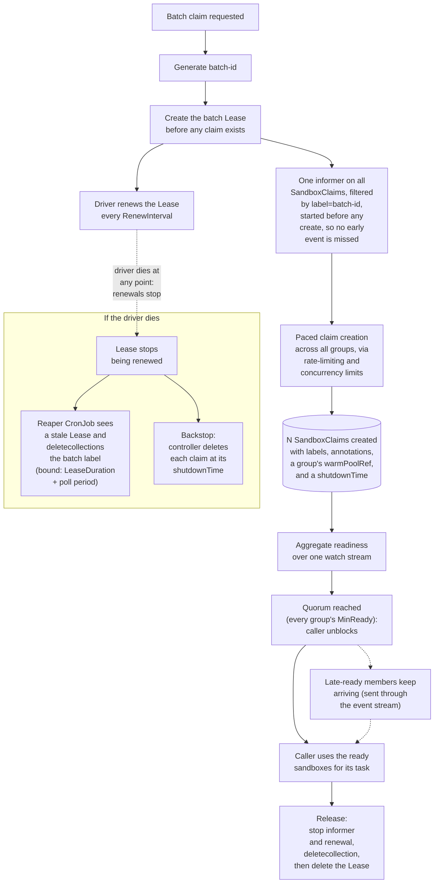

<!-- # KEP-NNNN: Sandbox Batch Claim API for SDK -->
# Sandbox Batch Claim API for SDK

## Summary

This document (which may later be changed to a KEP) introduces to the SDKs `ClaimBatch`, a method that claims N `Sandboxes` as a single batch and returns a `Batch` handle for interacting with them, giving SDK users consistent, reliable, and efficient batch claiming instead of the duplicated fan-out, polling, and cleanup logic every task currently manually implements. A batch may span several `SandboxWarmPools`, since the sandboxes a single run needs are not always the same shape.

## Motivation

Currently, work that involves claiming N `Sandboxes` as a batch, most notably in RL rollouts, a batch-eval harness, or our stress/benchmark tests, has to repeatedly and manually implement fan-out, polling, quorum, retry, and cleanup logic. Because the current SDK functions to claim `Sandboxes` were not designed with large scale claiming in mind, current efforts have suboptimal effects, such as (but not limited to):

- N watch connections for N claims
- A driver that dies partway through a fan-out leaks every claim it already created, until a user notices and cleans it up
- Readiness costs a watch stream per claim, and with the Python SDK in particular using HTTP/1.1, we have one TCP connection per claim, held open for the entire wait. These connections starve the client's connection pool, so at scale the create path stops reusing connections and dials a fresh one per claim.

## Proposal

This proposal introduces `ClaimBatch`, a method that claims N sandboxes as a single batch and returns a `Batch` handle for interacting with them. The SDK gains new methods and operators grant drivers one Role; they also optionally deploy one stateless reaper CronJob with another Role.

Goals:
- Support as a first-class feature in the SDKs. For Python, have async/sync parity and modify the `agent-sandbox-rl` library to use the feature instead.
- One call claims N Sandboxes with client-side pacing
- A batch spans one or more warm pools, so a run whose sandboxes are not all the same shape is still a single batch
- No per-claim watches established; instead, readiness is aggregated over a single watch stream corresponding to the batch
- A batch cannot outlive its driver unintentionally, including when the driver dies to `SIGKILL`, an OOM kill, or node preemption
- The Sandboxes in the batch can be used for a task as soon as a caller-specified quorum has been met

Non-goals:
- No server-side batch CRD and no controller changes
- No change to how a single sandbox is claimed
- No placement policy. A batch takes explicit per-pool sizes from the caller and never decides for itself how to spread a total across interchangeable pools.
- A batch is scoped to one cluster and one namespace. Multi-cluster rollouts compose K batches through the caller's placement, as the RL example already does.

## Design

### Batch Model

A batch organizes a set of claims around a singular batch id, and a shared cleanup path. It is composed of one or more `BatchGroups`, each naming a warmpool and how many `Sandboxes` to claim from it. Groups exist to allow for workloads which entail claiming many sandboxes across different images (e.g. eval harnesses).

A `Batch` has five core properties:
1. A randomly generated id with a leading letter so the id is a valid DNS label prefix for the Sandbox/Service names on a cold-started claim (a claim adopted from the warm pool keeps that Sandbox's own pre-generated name instead). The id is attached to each claim in the batch through the `agents.x-k8s.io/batch-id: <id>` label.
2. A deterministic name for each claim following the format `<batch-id>-<ordinal>`, so a retried create is idempotent. Ordinals come from one counter for the whole batch rather than one per group.
3. A `coordination.k8s.io/v1` Lease named `batch-<id>` in the same namespace as the claims, carrying the same batch-id label, which the driver renews while it is alive. Stale leases are later used for batch claim cleanup.
4. The annotations `agents.x-k8s.io/batch-group-size` and `agents.x-k8s.io/batch-group-min-ready` written on each claim to record its batch group's original size and minimum-ready count so `GetBatch` can recover them. We choose to write them on the claims to avoid a single point of failure and accept the duplicated cost at scale as a tradeoff.
5. All of a batch's claims live in one namespace. The controller only resolves a claim's warmPoolRef within the same namespace, and K namespace batch support would lead to K `deletecollection` calls instead of one, and messier RBAC.

`Batch` is designed as a handle following the same implemented pattern [KEP 359](../docs/keps/359-refactor-python-sdk/README.md) established for `Sandbox` in the Python SDK: obtained from a factory method (`ClaimBatch`/`GetBatch`), identified by a server-side id, re-attachable from a different process, and torn down by an explicit function (`Release`/`Detach`).

### Batch Lifecycle

#### Paced Creation

Creation of claims is paced in two ways:
- `create_rps`: A cap to how many creates start per second, to help avoid overwhelming the Kubernetes API server
- `max_in_flight`: A cap to bound how many creates are in flight at once, so a slow server response doesn't exhaust connections or stall the client

Note that this is pacing only for the client; server-side is through `--sandbox-warm-pool-max-batch-size` and `--sandbox-claim-concurrent-workers`.

For the Go SDK, these caps are inert until the default QPS/Burst settings on `rest.Config` are overridden (otherwise, caps are bounded by min(default, cap)).

Similarly for the Python SDK, the bound is the shared `ApiClient`'s connection pool (`connection_pool_maxsize`, defaulting to `cpu_count() * 5`): an in-flight cap set above the pool size thrashes on new connections instead of queuing cleanly. There is currently no supported way to raise it; however, [#1509](https://github.com/kubernetes-sigs/agent-sandbox/pull/1509) will fix this by letting callers inject a pre-configured `ApiClient` with a larger pool.

#### Membership

Each claim in a batch is represented as a `Member` object carrying its claim/sandbox identity, its group, and its readiness. A `Member` doesn't carry a `Sandbox` object, but can be used to connect to and return one.

We define the members created by `ClaimBatch` as the batch's initial fill, and support three methods for group membership changes: 
- `Acquire(warmpool)` which adds a member from the specified warmpool and blocks until Ready
- `ReleaseMember(member)` which deletes a member
- `Replace(member)` which calls `ReleaseMember` followed by `Acquire` on that member's own pool

Ordinals cannot be reused, as a released claim may still be terminating when its successor is created. Thus `<batch-id>-<ordinal>` uses a counter that increases monotonically over the batch's life.

#### Events and Quorum

A batch provides two ways to consume ready claims: streaming them as they become ready via an `Events` channel, or waiting for a baseline threshold of ready claims via `WaitForQuorum`. These mechanisms can be used independently or combined.

**Consumption models**:
- Stream-only: Callers read claims directly from `batch.Events()` as they become ready. The batch applies no readiness thresholds and never blocks execution.
- Quorum-gated streaming: Callers call `WaitForQuorum` which blocks until each group has at least `MinReady` members that are Ready (i.e. quorum is met), then returns the members synchronously, and `Events` continues streaming any subsequent ready claims in the background.

`MinReady` is a group-level field that only affects `WaitForQuorum`. If a caller does not call `WaitForQuorum`, `MinReady` has no effect. Quorum fails fast and returns errors if any group satisfies `size - terminalFailures - lost - createFailures < minReady`. We classify terminal reasons as ones that never resolve on their own (i.e. not transient errors), lost reasons as the claim being deleted from the batch, and create failures as non-retriable API errors (400, 403, 404, 422) and exhausted 429/5xx retries.

To calculate quorum efficiently, we replace the existing behavior of having a watch per claim with a single watch (informer) on the `SandboxClaims` collection, scoped to the batch's namespace and batch's id label to aggregate readiness for each claim in the batch. As the batch id label covers every group, adding groups adds no watches and the informer buckets each event by the claim's own `spec.warmPoolRef.name`.

Cache updates trigger a level-triggered reconciliation loop that tracks claimed resources in a local `dispatched` set to guarantee each claim is returned to the caller at most once. When `WaitForQuorum` resolves, it populates this set with the initial `MinReady` claims and returns them synchronously. Any remaining or late-arriving claims that reach Ready are added to `dispatched` and streamed over `Events`, ensuring members returned to the caller are never duplicates.

`Events` closes when the initial fill "settles", which we define as no initial-fill member being able to still arrive (i.e. either ready, terminal or lost). This allows a caller to write `for event in batch.events()` as its dispatch loop and finish as soon as the work is done.

#### Liveness

A `coordination.k8s.io/v1` Lease named `batch-<id>` is created before claim creation, and represents the batch's liveness state. While the driver is alive a background renewal loop (started automatically inside `ClaimBatch`) renews the Lease every `RenewInterval`.

If renewal itself starts failing while the driver is alive (writes throttled or erroring), we send a `LeaseDegraded` event, so the caller can checkpoint in-progress work or abort the batch.

We use the Lease in conjunction with a new stateless reaper process (likely running as a CronJob) that we introduce, which is responsible for deleting the claims of any batch whose Lease has gone stale.

#### Shutdown Backstop

We set `shutdownPolicy: Delete` and a `shutdownTime` on each claim, where `shutdownTime` represents the latest time that claim can exist. As a result, in event of liveness errors (e.g. a deadlocked main thread that still has the background thread renewing the Lease, crashed reaper CronJob), there is an additional mechanism for batch cleanup. This is not intended to be the primary cleanup mechanism and is therefore derived generously.

`shutdownTime` is computed per claim at that claim's own create time, as `created + QuorumTimeout + WorkBudget + margin`, rather than once for the batch. A replacement created an hour into a rolling run would otherwise inherit a deadline that has nearly passed, and would be deleted out from under the task it was just handed.

#### Cleanup

There are three ways a batch is cleaned up:

1. `Batch.Release()`, called explicitly or by the SDK's exit hooks, stops the informer and the renewal loop, makes a single call to the Kubernetes `deletecollection` API scoped to the batch's label, then deletes the Lease. As `deletecollection` is not atomic, `Release` re-lists by label and retries until the selector is empty.
2. Where the driver runs no code at all (`SIGKILL`, OOM kill, node preemption), the Lease is no longer renewed and the reaper issues the same label-scoped `deletecollection` to delete the claims, then delete the Lease.
3. The `shutdownTime` on the claim passes, and the claim is consequently deleted.

### Batch Lifecycle Diagram

This diagram walks through how `ClaimBatch` builds and runs the `Batch` handle end to end:



### RBAC

As a batch entails access to `deletecollection` for `SandboxClaims` and create/get/update/delete for `coordination.k8s.io` Leases, a Role will be needed to grant the driver further permissions to these.

The driver needs, in the batch's namespace:

```yaml
apiVersion: rbac.authorization.k8s.io/v1
kind: Role
metadata:
  name: sandbox-batch-driver
rules:
- apiGroups: ["extensions.agents.x-k8s.io"]
  resources: ["sandboxclaims"]
  verbs: ["create", "get", "list", "watch", "delete", "deletecollection"]
- apiGroups: ["coordination.k8s.io"]
  resources: ["leases"]
  verbs: ["create", "get", "update", "delete"]
```

Meanwhile, the reaper runs as a CronJob and needs, across the namespaces it is responsible for:

```yaml
apiVersion: rbac.authorization.k8s.io/v1
kind: ClusterRole
metadata:
  name: sandbox-batch-reaper
rules:
- apiGroups: ["coordination.k8s.io"]
  resources: ["leases"]
  verbs: ["get", "list", "watch", "delete"]
- apiGroups: ["extensions.agents.x-k8s.io"]
  resources: ["sandboxclaims"]
  verbs: ["list", "deletecollection"]
```

## 5. SDK API Additions

### 5.1 Core Batch Methods

- `claim_batch`: Create a new batch, returning a `Batch` handle
- `get_batch`: Return a batch handle (no create) of an existing batch by id, resuming lease renewal
- `wait_for_quorum`: Blocks until quorum is reached or not and returns either initial fill or error
- `connect(member)`: Returns a connected `Sandbox` (same return type as `Client.GetSandbox`) for interactive use. In contrast to `GetSandbox`, because information is already stored in `Member`, it skips the API calls to get the Sandbox and claim details and connects to the `Sandbox` directly.
- `acquire(warmpool)`: Adds a member to the batch from any pool in its namespace, not only the pools named at create time. Blocks until Ready and returns it, and raises if it fails terminally
- `release_member(member)`: Deletes one member's claim, with no successor
- `replace(member)`: `release_member` then `acquire` on that member's own pool. Blocks until the successor is Ready and returns it, and raises if it fails terminally
- `events`: A live channel of member transitions, closed once the initial fill settles
- Cleanup
    - `release`: Stop the informer and renewal, `deletecollection` the batch label, delete the Lease
    - `detach`: Stops the informer and renewal but leaves the claims alive for a later `get_batch`.
    - `release_not_ready`: Deletes only the members that never reached `Ready`

### Python
Helper/supporting classes:
```python
class BatchGroup(BaseModel):
    """One warm-pool's share of a batch."""
    warmpool: str
    size: int
    min_ready: int | None = None                    # defaults to size

class BatchEventType(str, Enum):
    MEMBER_READY = "member_ready"
    MEMBER_LOST = "member_lost" 
    MEMBER_FAILED = "member_failed"
    LEASE_DEGRADED = "lease_degraded"

class Member(BaseModel):
    """One claim in a batch, with its identity, its group, and current readiness."""
    claim_name: str
    sandbox_name: str
    warmpool: str                                   # the group this member belongs to
    pod_ips: list[str] = []
    service_fqdn: str | None = None
    ready: bool = False
    terminal: bool = False
    lost: bool = False 
    reason: str | None = None
    message: str | None = None

class BatchEvent(BaseModel):
    """A member Ready transition, or a batch-level event carrying no member."""
    type: BatchEventType
    member: Member | None = None
```

Claim batch:
```python
# most optional args will have some default value later TBD
class AsyncSandboxClient:
    async def claim_batch(
        self,
        groups: Sequence[BatchGroup],               # one entry for a single-pool batch
        *,
        namespace: str = "default",
        labels: dict[str, str] | None = None,
        batch_id: str | None = None,                # to allow overrides

        # --- pacing and connection reuse ---
        create_rps: float | None = None,
        max_in_flight: int | None = None,

        # --- time ---
        work_budget: float | None = None,           # expected post-quorum working time
        quorum_timeout: float | None = None,
        lease_duration: float | None = None,
    ) -> "AsyncSandboxBatch": ...

    async def get_batch(
        self,
        batch_id: str,
        namespace: str = "default",
        *,
        adopt_expired: bool = False,                # re-create the Lease instead of failing
    ) -> "AsyncSandboxBatch": ...

# There will also be a SandboxClient claim_batch and get_batch with the same shape, just without async functions. 
```

Batch handle:
```python
class AsyncSandboxBatch:
    batch_id: str
    namespace: str
    groups: list[BatchGroup]
    size: int                                             # sum of the group sizes

    async def wait_for_quorum(self, timeout: float | None = None) -> list[Member]: ...
    def members(self, warmpool: str | None = None) -> list[Member]: ...   # current snapshot
    def events(self) -> AsyncIterator[BatchEvent]: ...
    def err(self) -> Exception | None: ...

    async def connect(self, member: Member) -> AsyncSandbox: ...
    async def acquire(self, warmpool: str, timeout: float | None = None) -> Member: ...
    async def release_member(self, member: Member) -> None: ...
    async def replace(self, member: Member, timeout: float | None = None) -> Member: ...

    async def release(self) -> None: ...
    async def release_not_ready(self) -> None: ...
    async def detach(self, grace: float | None = None) -> None: ...

# There will also be a SandboxBatch variant which is similar to above, but uses Iterator over AsyncIterator, contains no async functions, and returns a Sandbox type for connect()
```

### Go

The Go SDK mirrors the Python SDK additions, with the following differences:
- Extends the single client and adds a single `Batch` struct as there is no async/sync class differences
- `claim_batch`'s keyword arguments become a `BatchOptions` struct, with the groups in a required `Groups []BatchGroup` field.
- The event iterator becomes a receive-only channel

## SDK Usage

### Python

Examples use the async Python class, and the `SandboxClient`/`SandboxBatch` variant is the same code with `await` removed and `for` in place of `async for`.

#### Fixed cohort example

Claim a batch from one pool, start at quorum, release together.

```python
async with AsyncSandboxClient(connection_config=cfg) as client:
    batch = await client.claim_batch(
        [BatchGroup(warmpool="rollout-pool", size=200, min_ready=180)],
        work_budget=600,
    )
    try:
        ready = await batch.wait_for_quorum()
        await run_wave(batch, ready)
    finally:
        await batch.release()

async def run_wave(batch, ready):
    tasks = [asyncio.create_task(run_one(batch, m)) for m in ready]
    async for event in batch.events():          # late arrivals; ends when the batch settles
        if event.type is BatchEventType.MEMBER_READY:
            tasks.append(asyncio.create_task(run_one(batch, event.member)))
    await asyncio.gather(*tasks)
    if batch.err():                             # e.g. lease renewal stopped succeeding
        raise batch.err()

async def run_one(batch, member):
    sbx = await batch.connect(member)
    return await sbx.commands.run("python rollout.py")
```

#### Rolling, multi-pool example

Hold `size` members per group and swap each for a fresh one from its own group as its task finishes. We set `min_ready=1` to start as soon as each group has at least one member ready, with the rest joining through `events()`. `wait_for_quorum()` blocks until `min_ready` is achieved for all groups, but as a tradeoff a slow pool's first member will cause idle Sandboxes in the other pools until it is ready.


```python
pool = collections.defaultdict(list)
for t in tasks:
    pool[pool_for(t.image)].append(t)

batch = await client.claim_batch(
    groups=[BatchGroup(warmpool=p, size=min(len(ts), 40), min_ready=1)
            for p, ts in pool.items()],
    work_budget=3600,
)
try:
    pending, unrun = {p: asyncio.Queue() for p in pool}, []
    for p, ts in pool.items():
        for t in ts:
            pending[p].put_nowait(t)

    async def worker(member):
        first = True
        while True:
            try:
                task = pending[member.warmpool].get_nowait()
            except asyncio.QueueEmpty:
                return                          # no more work; member is left for release() to collect
            if not first:
                # Replace only with a task in hand, so the run never claims a trailing sandbox it will not use.
                try:
                    member = await batch.replace(member)   # same group, blocks until Ready
                except TerminalMemberError:
                    pending[member.warmpool].put_nowait(task)   # untried; a peer can run it
                    return                      # leave worker pool due to error
            first = False
            await run_task(task, await batch.connect(member))

    workers = [asyncio.create_task(worker(m)) for m in await batch.wait_for_quorum()]
    async for event in batch.events():          # remainder of the initial fill, all groups
        if event.type is BatchEventType.MEMBER_READY:
            workers.append(asyncio.create_task(worker(event.member)))
    await asyncio.gather(*workers)

    for p, q in pending.items():                # a group that lost every worker leaves work behind
        while not q.empty():
            unrun.append((p, q.get_nowait()))   # never attempted, not the same as failed
finally:
    await batch.release()
```

#### Independent multi-pool example

This example has the same structure as the rolling, multi-pool example above but bypasses `wait_for_quorum()` to allow a group's work to be done as soon as a single claim in it is ready, independent from other groups. This is achieved by retrieving members from `events()` instead.

```python
batch = await client.claim_batch(
    groups=[BatchGroup(warmpool=p, size=min(len(ts), 40)) for p, ts in pool.items()],
    work_budget=3600,
)
try:
    pending, unrun = {p: asyncio.Queue() for p in pool}, []
    for p, ts in pool.items():
        for t in ts:
            pending[p].put_nowait(t)

    workers = []
    async for event in batch.events():
        if event.type is BatchEventType.MEMBER_READY:
            workers.append(asyncio.create_task(worker(event.member)))
    await asyncio.gather(*workers)

    for p, q in pending.items():                # a group that lost every worker leaves work behind
        while not q.empty():
            unrun.append((p, q.get_nowait()))   # never attempted, not the same as failed
finally:
    await batch.release()
```

### Go

Go's SDK usage shares the same structure as Python's usage above, but with some syntax differences due to language/library differences.

For fixed cohort, claim and cleanup:
```go
b, err := client.ClaimBatch(ctx, sandbox.BatchOptions{
    Groups:     []sandbox.BatchGroup{{WarmPool: "rollout-pool", Size: 200, MinReady: 180}},
    WorkBudget: 10 * time.Minute,
})
if err != nil {
    return err
}
defer b.Release(ctx)
```

From there `b.WaitForQuorum(ctx)` returns the ready members and dispatch is an `errgroup` over that slice, plus one goroutine ranging over `b.Events()` to pick up the rest of the initial fill.

For rolling mode, a worker ranges over its own group's channel and the producer closes each channel once it is filled, where the Python loop instead exits on an empty queue.

### Agent Sandbox RL

#### Upgrading Existing Evaluation Executors

In `fleet.run()`, agent-sandbox-rl uses an executor called once per window to execute benchmark tasks. The existing executors (`process_parallel` and `reuse_git_restore_sandbox`) manage claims individually through `fleet.acquire(task)` and `fleet.release(handle)`.

For standard evaluation workloads (1 task per image), we introduce a `batch=True` flag on `fleet.run()`. This enables `BatchClaimer`, a drop-in adapter that replaces individual claim churn with a single batch per cluster, lazily expanding groups as worker threads demand them while keeping active cluster claims strictly bounded by concurrency limits.

```python
class BatchClaimer:
    def __init__(self, fleet):
        self._fleet = fleet
        self._lock = threading.Lock()
        self._batches = {}     # cluster name -> Batch
        self._members = {}     # claim_name -> (Batch, Member)

    def _batch_for(self, cluster):
        with self._lock:
            if cluster.name not in self._batches:
                pools = {e.pool for e in self._fleet.plan_.by_cluster()[cluster.name]}
                self._batches[cluster.name] = cluster.sandbox_client.claim_batch(
                    groups=[BatchGroup(warmpool=p, size=0) for p in pools],
                    namespace=cluster.namespace,
                    labels=dict(self._fleet.config.labels),
                    work_budget=self._fleet.config.work_budget,
                )
            return self._batches[cluster.name]

    def acquire(self, task) -> SandboxHandle:
        entry = self._fleet.plan_.for_image(task.image)
        cluster = self._fleet.registry.get(entry.cluster)
        b = self._batch_for(cluster)
        member = b.acquire(entry.pool, timeout=self._fleet.config.ready_timeout)
        handle = self._fleet.handle_for(cluster, member, task)
        with self._lock:
            self._members[handle.claim_name] = (b, member)
        return handle

    def release(self, handle: SandboxHandle) -> None:
        with self._lock:
            b, member = self._members.pop(handle.claim_name)
        b.release_member(member)

    def release_all(self) -> None:
        """Backstop cleanup on exit via DeleteCollection."""
        for b in self._batches.values():
            b.release()
```

New `process_parallel`:
```python
def process_parallel(fleet, tasks, process_fn, concurrency, *, batch=False):
    results = [None] * len(tasks)
    claimer = BatchClaimer(fleet) if batch else fleet

    def _one(task):
        handle = claimer.acquire(task)
        try:
            return process_fn(task, handle)
        finally:
            claimer.release(handle)

    try:
        with ThreadPoolExecutor(max_workers=concurrency) as ex:
            futs = {ex.submit(_one, t): i for i, t in enumerate(tasks)}
            for f in as_completed(futs):
                results[futs[f]] = f.result()
        return results
    finally:
        if batch:
            claimer.release_all()
```

Caller code (`batch=True`):
```python
# Evaluates sliding or pipelined windows with bounded cluster concurrency
results = fleet.run(process_fn, strategy="pipelined", concurrency=40, batch=True)
```

We make similar changes for `reuse_git_restore_sandbox` and the async executor variants.

#### Rollout Waves: Cohort-Based RL Execution

For SWE-bench-style RL workloads where cohorts of G tasks target problem environments, we introduce the `rollout_wave` executor. Selected via `wave=True` on `fleet.run()` (mutually exclusive with `recycle=True`), it provides cohort-based batch allocation for rollout waves.

While `BatchClaimer` expands lazily from `size=0` to bound active claims to worker concurrency, `rollout_wave` declares each pool's full cohort size (`size=G`) upfront. This creates all G `SandboxClaim` resources simultaneously, allowing parallel claim creation.

`rollout_wave` supports two dispatch paradigms via `sync`:
- `sync=True` (Synchronous On-Policy RL): Uses `batch.wait_for_quorum()` to block until `min_ready` members are Ready (e.g. PPO/GRPO trajectory collection)
* `sync=False` (Asynchronous Streaming Rollouts): Uses only `batch.events()` to receive Ready members, preventing Ready delays in a slow pool from stalling execution in a faster one (e.g. IMPALA/APPO actor loops).

```python
# Calling code: Synchronous on-policy RL rollout wave
results = fleet.run( process_fn, strategy="sliding", wave=True, sync=True, concurrency=64)

# Calling code: Asynchronous streaming RL rollout wave
results = fleet.run( process_fn, strategy="pipelined", wave=True, sync=False, concurrency=64)

def rollout_wave(fleet, tasks, process_fn, concurrency, *, sync=True):
    results = [None] * len(tasks)
    by_cluster = collections.defaultdict(lambda: collections.defaultdict(list))
    for i, t in enumerate(tasks):
        entry = fleet.plan_.for_image(t.image)
        by_cluster[entry.cluster][entry.pool].append((i, t))

    def _run_cluster(cluster_name, pools):
        cluster = fleet.registry.get(cluster_name)
        # Sized upfront per cohort (size=G) for parallel cluster warming
        batch = cluster.sandbox_client.claim_batch(
            groups=[
                BatchGroup(
                    warmpool=p,
                    size=len(pool_tasks),
                    min_ready=len(pool_tasks),
                )
                for p, pool_tasks in pools.items()
            ],
            namespace=cluster.namespace,
            labels=dict(fleet.config.labels),
            work_budget=fleet.config.work_budget,
        )

        with ThreadPoolExecutor(max_workers=concurrency) as ex:
            futs = []
            try:
                if sync:
                    # Synchronous: Unblock once quorum is achieved across the cohort
                    ready_members = batch.wait_for_quorum(timeout=fleet.config.ready_timeout)
                    pool_members = collections.defaultdict(list)
                    for m in ready_members:
                        pool_members[m.warmpool].append(m)

                    for pool, pool_tasks in pools.items():
                        for (i, task), member in zip(pool_tasks, pool_members[pool]):
                            futs.append(ex.submit(_run_task, fleet, cluster, batch, task, member, process_fn, results, i))
                else:
                    # Asynchronous: Dispatch tasks as individual members arrive via event stream
                    pool_tasks = {p: list(ts) for p, ts in pools.items()}
                    for event in batch.events():
                        if event.type != BatchEventType.MEMBER_READY:
                            continue
                        pool = event.member.warmpool
                        if pool_tasks[pool]:
                            i, task = pool_tasks[pool].pop(0)
                            futs.append(ex.submit(_run_task, fleet, cluster, batch, task, event.member, process_fn, results, i))
            finally:
                for f in futs:
                    f.result()
                batch.release()  # DeleteCollection cleanup for all claims in this batch

    with ThreadPoolExecutor(max_workers=len(by_cluster)) as cx:
        for f in [cx.submit(_run_cluster, c, p) for c, p in by_cluster.items()]:
            f.result()

    return results


def _run_task(fleet, cluster, batch, task, member, process_fn, results, i):
    handle = fleet.handle_for(cluster, member, task)
    try:
        results[i] = process_fn(task, handle)
    finally:
        batch.release_member(member)
```

### Scalability

#### Batch Claim Improvements

Currently, claiming a `Sandbox` involves:
1. A `create` call to make the `SandboxClaim`.
2. Checking `Sandbox` readiness, which differs across SDKs:
   - **Go:** A `get` on the claim to check whether the controller has mirrored the `Sandbox` name onto its status, falling back to a `watch` on the claim if not. Once the name is known, a separate `list` is performed on the `Sandbox` object itself to check whether its pod is scheduled and has an IP, falling back to a `watch` on the `Sandbox` if not.
   - **Python:** A single unconditional `watch` on the claim, waiting for the controller to mirror the `Sandbox`'s name, `podIPs`, and forwarded `Ready` condition onto the claim's status in a single update.
3. Deleting the claim once the caller is done with it via an individual `delete` call.

Through the use of batch claiming, we see improvements in control-plane connection overhead, watch resource saturation, and lifecycle management efficiency compared to the current approach:

| Dimension | Current (`CreateSandbox` x N) | Batch Claim (`ClaimBatch`) |
| :--- | :--- | :--- |
| **Claim Creation** | N creates (Go: +N gets) | N creates |
| **Sandbox Pod Checks** | N list calls (Go only) | 0 (mirrored onto claim status) |
| **Readiness Watches** | N (Go: 2N, Python: N) | 1 watch stream across all groups |
| **Control-Plane Connections** | O(N) dialed/discarded (Python)<br>ceil(2N/100) streams (Go) | O(MaxInFlight), reused |
| **Batch Deletion** | N individual `Delete` calls | **Fixed Cohort:** 1 deletecollection<br>**Rolling:** M individual deletes (where M <= N) + 1 deletecollection  |

#### Transport & Connection Scaling

Under the current individual claim approach, both SDKs hit connection bottlenecks well before N gets large due to unmanaged defaults:
- **Control-Plane Watch Saturation:** Long-lived readiness watches for each individual claim exhaust client connection budgets. The Python SDK [defaults](
https://github.com/kubernetes-client/python/blob/master/kubernetes/client/configuration.py#L334-L337) to a `connection_pool_maxsize` of `cpu_count() * 5` and sets `block=False` so new requests/watches dial a new connection, incurring connection setup overhead. Meanwhile, the Go SDK has a 100 concurrent stream HTTP/2 cap and relies on the `client-go` defaults of  `QPS: 5` and `Burst: 10`, causing client-side queuing during create bursts.
- **Data-Plane Host Eviction:** Existing SDK connectors use conservative default connection limits (e.g., Python sync capping cached host pools at 10), causing active socket eviction when communicating across hundreds of distinct sandbox pod IPs.

Batch claiming helps free up connections through mechanisms such as eliminating per-claim readiness checks and instead, using a single informer. To further support connection scalability, we propose the following transport changes:

**Control Plane (Kubernetes API):**
Because clients are instantiated before batch parameters are known, connection budgets cannot be dynamically resized at claim time. Instead, both SDKs adopt a construction-time configuration with runtime validation model:
- Python: 
  - Add an explicit `pool_size: int | None = None` parameter to `SandboxClient()` / `AsyncSandboxClient()` to configure `connection_pool_maxsize`.
  - At runtime, `ClaimBatch` validates that `connection_pool_maxsize >= max_in_flight` (accounting for custom injected `api_client`s via [#1509](https://github.com/kubernetes-sigs/agent-sandbox/pull/1509) as well). If undersized, it raises an error instructing the caller to either lower `max_in_flight` or construct `SandboxClient` with a sufficient `pool_size`.
- Go: 
  - `NewK8sHelper` already accepts a custom `*rest.Config`, so callers supply a config with elevated `QPS`/`Burst` and transport sharding (mirroring agent-sandbox-controller's [established pattern](https://github.com/kubernetes-sigs/agent-sandbox/blob/527d9346fe1d237dea5c003f3c720531c7bab1df/cmd/agent-sandbox-controller/transport.go#L32-L61)).
  - `ClaimBatch` validates that `Burst >= max_in_flight`.

**Data Plane (Sandbox Endpoints):**
Existing SDK connectors use unmanaged pool defaults that evict active sockets when connecting to many sandbox endpoints:
  - *Python sync (`requests` library):* Defaults to [pool_connections=10](https://github.com/psf/requests/blob/dae7ef63b4df6eded86637f251fc4e3a06c3b479/src/requests/adapters.py#L80), evicting the least-recently-used host's entire pool once a batch exceeds 10 distinct pod IPs.
  - *Python async (`httpx`):* Uses [max_connections=100 and max_keepalive_connections=20](https://github.com/encode/httpx/blob/b5addb64f0161ff6bfe94c124ef76f6a1fba5254/httpx/_config.py#L247) across all origins, throttling concurrency across larger cohorts.
  - *Go (`http.Transport`):* Sets [MaxIdleConns: 100 and MaxIdleConnsPerHost: 10](https://github.com/kubernetes-sigs/agent-sandbox/blob/527d9346fe1d237dea5c003f3c720531c7bab1df/clients/go/sandbox/connector.go#L114-L115), closing idle sockets as concurrent endpoints outgrow the cache.

To fix this, `batch.connect()` shares a single connection pool across the entire batch with capacity sized to ~N (`pool_connections` in Python sync, `max_connections` / `max_keepalive_connections` in Python async, and `MaxIdleConns` in Go) to maintain persistent connections to each unique sandbox IP and avoid socket churn between steps.

#### Batch Scaling

We analyze batch resource costs at scale across 4 axes:

- **Batch Size (N):**
  - **Informer Memory:** Scales as O(N), as the client stores every claim in local memory to track its readiness and status.
  - **Watch Event Volume:** Emits O(N) events over the batch lifecycle (claim creation, status phase changes, deletion).
- **Warm Pool Groups (G):**
  - Supporting G groups in a single batch consolidates multi-image rollouts into a single label-scoped watch and a single `Lease` per cluster, avoiding the overhead of managing G independent single-pool batches.
- **Active Batches (B):**
  - Background reaper overhead scales with O(B) as it tracks 1 Lease per active batch.
  - The reaper's cache memory and watch event volume scale as O(B) as the cache stores one Lease object and the watch event produces O(1) renewal events per active batch.
- **Batch Lifetime (Time):**
  - The write overhead of lease renewal should effectively be O(1) over time, as a batch emits only 1 write to the batch's single Lease object per `RenewInterval`.

#### Client-side vs. Server-side Scaling

As batch claim is implemented as a client-side feature, we investigate the bottlenecks that may arise at large N claim volume:

1. **Client Fan-Out Latency & API Throttling:** Creating N claims requires N individual HTTP POST requests from the client. Even with connection pooling and `MaxInFlight` pacing, issuing tens of thousands of requests from an external client over network hops takes considerable wall-clock time and risks triggering API Priority and Fairness (APF) rate-limiting on the API server.
2. **Slow Cleanup:** Because liveness is governed by client heartbeat renewals, an unexpected driver crash (`SIGKILL` or host failure) leaves N sandboxes idling until the `Lease` times out and the background reaper executes. With an early crash failure, a significant amount of cluster compute and quota could be tied up and idle for an extensive amount of time, especially if `work_budget` is set high.
3. **Client-Side Informer Memory:** Retaining tens of thousands of claim states in memory for event streaming and quorum tracking increases client memory footprint, creating OOM risks on resource-constrained runner pods.

In contrast to these scaling issues from client-side batching, a dedicated server-side batch CRD would instead offload claim dispatch, aggregation, and lifecycle tracking to cluster-local controllers. This would mean:
- The client issues a single batch create request for N claims. While total creations remain unchanged as work shifts to the controller, this significantly reduces cross-network round-trips for external drivers and allows claim fan-out to run under higher in-cluster APF priority tiers.
- The client's watch would only be on a single `SandboxBatch` object for readiness, rather than a single watch on N claims
- For in-cluster runner jobs, a CRD can bind claims to the running Job/Pod via `ownerReferences` so Kubernetes garbage collection automatically cleans up the claims (and their underlying sandboxes) upon driver termination, eliminating the need for a Lease and background reaper.

Due to these benefits, we should re-evaluate implementing batch claiming server-side when client-side request latency, memory overhead, or the cost of maintaining reaper and Lease become operational bottlenecks.

## Alternatives

- Single-pool batches: A caller could claim one batch per pool (for G pools) and coordinate them itself. However, that would lead to G Leases, G informers, and G `deletecollection` calls.
- Server-Side Batch CRD: A server-side CRD would cleanup without a reaper and survive death natively, but introduces upgrade burden (CRD management/versioning, an extra controller, RBAC, controller deployments). Callers still require client-side pacing, transport pooling, and crash handling regardless.
- Liveness replacements: Instead of creating a single `Lease` per batch, liveness could be tracked either by a heartbeat timestamp directly on each claim's status. We reject this as it would lead to N writes every renewal interval.
- Batch metadata location: We could combine all batch group information and write it only once, either on the `Lease` object directly, or a `ConfigMap` object that a `Lease` would reference. We reject the former as annotations are rejected if they have size > 256 KiB which would cap out at around ~3-5k groups, and we reject the latter, as it would entail an additional object for the reaper to maintain. We also accept the tradeoff of redundant information writing on each claim to prevent a single point of failure.
