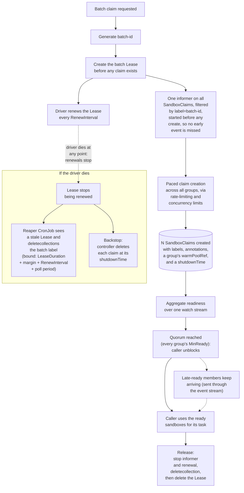

<!-- # KEP-NNNN: Sandbox Batch Claim API for SDK -->
# Sandbox Batch Claim API for SDK

## Summary

This document introduces to the SDKs `ClaimBatch`, a method that claims N `Sandboxes` as a single batch and returns a `Batch` handle for interacting with them, giving SDK users consistent, reliable, and efficient batch claiming instead of the duplicated fan-out, polling, and cleanup logic every task currently manually implements. A batch may span several `SandboxWarmPools`, since the sandboxes a single run needs are not always the same shape.

## Motivation

Currently, work that involves claiming N `Sandboxes` as a batch, most notably in RL rollouts, a batch-eval harness, or our stress/benchmark tests, has to repeatedly and manually implement fan-out, polling, quorum, retry, and cleanup logic. Because the current SDK functions to claim `Sandboxes` were not designed with large scale claiming in mind, current efforts have suboptimal effects, such as (but not limited to):

- N watch connections for N claims
- A driver that dies partway through a fan-out leaks every claim it already created, until a user notices and cleans it up
- Readiness costs a watch stream per claim, and with the Python SDK in particular using HTTP/1.1, we have one TCP connection per claim, held open for the entire wait. These connections starve the client's connection pool, so at scale the create path stops reusing connections and dials a fresh one per claim.

## Proposal

This proposal introduces `ClaimBatch`, a method that claims N sandboxes as a single batch and returns a `Batch` handle for interacting with them. The SDK gains new methods and operators grant drivers one Role; they also optionally deploy one stateless reaper CronJob with another Role.

Goals:
- Support as a first-class feature in the SDKs. For Python, have async/sync parity and modify the `agent-sandbox-rl` library to use the feature instead.
- One call claims N Sandboxes with client-side pacing
- A batch spans one or more warm pools, so a run whose sandboxes are not all the same shape is still a single batch
- No per-claim watches established; instead, readiness is aggregated over a single watch stream corresponding to the batch
- A batch cannot outlive its driver unintentionally, including when the driver dies to `SIGKILL`, an OOM kill, or node preemption
- The Sandboxes in the batch can be used for a task as soon as a caller-specified quorum has been met

Non-goals:
- No server-side batch CRD and no controller changes
- No change to how a single sandbox is claimed
- No placement policy. A batch takes explicit per-pool sizes from the caller and never decides for itself how to spread a total across interchangeable pools.
- A batch is scoped to one cluster and one namespace. Multi-cluster rollouts compose K batches through the caller's placement, as the RL example already does.

## Design

### Batch Model

A batch organizes a set of claims around a singular batch id, and a shared cleanup path. It is composed of one or more `BatchGroups`, each naming a warmpool and how many `Sandboxes` to claim from it. Groups exist to allow for workloads which entail claiming many sandboxes across different images (e.g. eval harnesses).

A `Batch` has five core properties:
1. A randomly generated id with a leading letter so the id is a valid DNS label prefix for the Sandbox/Service names on a cold-started claim (a claim adopted from the warm pool keeps that Sandbox's own pre-generated name instead). The id is attached to each claim in the batch through the `agents.x-k8s.io/batch-id: <id>` label.
2. A deterministic name for each claim following the format `<batch-id>-<ordinal>`, so a retried create is idempotent. Ordinals come from one counter for the whole batch rather than one per group.
3. A `coordination.k8s.io/v1` Lease named `batch-<id>` in the same namespace as the claims, carrying the same batch-id label, which the driver renews while it is alive. Stale leases are later used for batch claim cleanup. The Lease also records the batch's total initial size (`agents.x-k8s.io/batch-size`), so `GetBatch` can tell initial claims from later ones even when every claim of a group is gone, and `Detach` records the next unused ordinal on it (`agents.x-k8s.io/batch-next-ordinal`), so a handle that re-attaches never reuses one.
4. The annotations `agents.x-k8s.io/batch-group-size` and `agents.x-k8s.io/batch-group-min-ready` written on each claim to record its batch group's original size and minimum-ready count so `GetBatch` can recover them. We choose to write them on the claims to avoid a single point of failure and accept the duplicated cost at scale as a tradeoff. For groups that are created with `size=0`, we omit writing these annotations and have the user recover them via `members(warmpool_name)` (see API reference tab); `GetBatch` also assumes they have an initial `size=0` and thus `min_ready=0`.
5. All of a batch's claims live in one namespace. The controller only resolves a claim's warmPoolRef within the same namespace, and K namespace batch support would lead to K `deletecollection` calls instead of one, and messier RBAC.

`Batch` is designed as a handle following the same implemented pattern [KEP 359](../docs/keps/359-refactor-python-sdk/README.md) established for `Sandbox` in the Python SDK: obtained from a factory method (`ClaimBatch`/`GetBatch`), identified by a server-side id, re-attachable from a different process, and torn down by an explicit function (`Release`/`Detach`).

### Batch Lifecycle

#### Paced Creation

Creation of claims is paced in two ways:
- `create_rps`: A cap to how many creates start per second, to help avoid overwhelming the Kubernetes API server
- `max_in_flight`: A cap to bound how many creates are in flight at once, so a slow server response doesn't exhaust connections or stall the client

Claims are created in the order that reaches quorum soonest. Each group's first `MinReady` claims go first, interleaved across groups in proportion to their sizes, and the rest follow. Ordinals still come from one batch-wide counter, so a group's ordinals need not be contiguous.

Note that this is pacing only for the client; server-side is through `--sandbox-warm-pool-max-batch-size` and `--sandbox-claim-concurrent-workers`.

For the Go SDK, these caps are inert until the default QPS/Burst settings on `rest.Config` are overridden (otherwise, caps are bounded by min(default, cap)).

Similarly for the Python SDK, the bound is the shared `ApiClient`'s connection pool size. Callers can raise it by injecting a pre-configured `ApiClient` with a larger pool ([#1509](https://github.com/kubernetes-sigs/agent-sandbox/pull/1509)). We talk more about this in the "Transport & Connection Scaling" section in the Scalability tab.

#### Membership

Each claim in a batch is represented as a `Member` object carrying its claim/sandbox identity, its group, and its readiness. A `Member` doesn't carry a `Sandbox` object, but can be used to connect to and return one.

We define the members created by `ClaimBatch` as the batch's initial fill, and support two methods for group membership changes: 
- `Acquire(warmpool)` which adds a member from the specified warmpool and blocks until Ready
- `ReleaseMember(member)` which deletes a member

A caller that wants a fresh sandbox in place of a used one calls `ReleaseMember` and then `Acquire` on the same pool. The pair isn't atomic and holds no capacity in between, so it isn't offered as a separate method.

Ordinals cannot be reused, as a released claim may still be terminating when its successor is created. Thus `<batch-id>-<ordinal>` uses a counter that increases monotonically over the batch's life. A handle that detaches records the next unused ordinal on the Lease, and a handle that re-attaches continues from it.

#### Events and Quorum

A batch provides three ways to consume ready claims: streaming them as they become ready via an `Events` channel, waiting for a baseline threshold of ready claims across the whole batch via `WaitForQuorum`, or consuming each group's own threshold independently via `IterReadyGroups`. These mechanisms can be used independently or combined, with two exceptions. `WaitForQuorum` and `IterReadyGroups` are mutually exclusive on the same batch, and neither can be called after `Events`, because the first consumer called fixes how the batch hands out members.

**Consumption models**:
- Stream-only: Callers read claims directly from `batch.Events()` as they become ready. The batch applies no readiness thresholds and never blocks execution.
- Quorum-gated streaming: Callers call `WaitForQuorum` which blocks until each group has at least `MinReady` members that are Ready (i.e. quorum is met) across the whole batch, then returns the members synchronously, and `Events` continues streaming any subsequent ready claims in the background.
- Per-group quorum streaming: Callers range over `IterReadyGroups`, which yields once per group, as soon as that group's own `MinReady` is met or becomes unreachable, independent of every other group's progress. This lets a fast group dispatch its cohort without waiting on a slow group sharing the same batch, unlike `WaitForQuorum`, which gates on all groups at once. It closes once every group has yielded exactly once.

Because a group can be created lazily (i.e. `size=0` then claim members via `acquire()`), `WaitForQuorum` and `IterReadyGroups` only check readiness and return for groups with `(initial) size != 0`.

`MinReady` is a group-level field that only affects `WaitForQuorum` and `IterReadyGroups`. If a caller uses neither, `MinReady` has no effect. We calculate group failure to fail fast via `size - terminalFailures - lost - createFailures < minReady`. We classify terminal reasons as ones that never resolve on their own (i.e. not transient errors), lost reasons as the claim being deleted from the batch, and create failures as non-retriable API errors (400, 403, 404, 422) and exhausted 429/5xx retries. Both `WaitForQuorum` and `IterReadyGroups` fail-fast, but with different scopes: `WaitForQuorum` fails the whole call if any single group becomes unreachable, while `IterReadyGroups` scopes the check to each group independently, so one unreachable group never affects groups that already met quorum or are still filling. An unreachable group's yield from `IterReadyGroups` carries an error and no members. A group, or the quorum, that hasn't reached `MinReady` by the fill deadline (`QuorumTimeout` after the last paced create) fails with `BatchTimeoutError`, which is both a `BatchError` and a `TimeoutError`. Cancelling a `WaitForQuorum` call fails the quorum the same way, since nothing could collect its members afterwards.

A group whose outcome is an error is finished. The batch creates no more of its claims, and in `IterReadyGroups` mode it deletes the claims it already created, since none of them can be handed out and they would otherwise hold their sandboxes until `Release`. A caller that wants a partial cohort sets a lower `MinReady`. When `WaitForQuorum` fails, the whole batch is finished, no more claims are created, and the caller releases it.

To calculate quorum efficiently, we replace the existing behavior of having a watch per claim with a single watch (informer) on the `SandboxClaims` collection, scoped to the batch's namespace and batch's id label to aggregate readiness for each claim in the batch. As the batch id label covers every group, adding groups adds no watches and the informer buckets each event by the claim's own `spec.warmPoolRef.name`.

Each informer event updates the batch's per-group counts in constant time, and a local `dispatched` set tracks the claims already handed out, so each claim is returned to the caller at most once. When `WaitForQuorum` resolves, it populates this set with the initial `MinReady` claims across every group and returns them synchronously; `IterReadyGroups` populates it one group's `MinReady` claims at a time, on each yield. Because both draw down the same `dispatched` set for the initial fill, a batch uses at most one of them to avoid races. Any remaining or late-arriving claims that reach Ready, for either model, are checked against then added to `dispatched` and streamed over `Events`, ensuring members returned to the caller are never duplicates.

`Events` closes when the initial fill "settles", which we define as no initial-fill member being able to still arrive (i.e. either ready, terminal or lost). It also closes at the fill deadline, and when `Err` is set. `Events` covers only the initial fill, so a member that fails or is deleted after it closes shows up in `Members` and as failing commands, not as an event. This allows a caller to write `for event in batch.events()` as its dispatch loop and finish as soon as the work is done.

#### Liveness

A `coordination.k8s.io/v1` Lease named `batch-<id>` is created before claim creation, and represents the batch's liveness state. While the driver is alive a background renewal loop (started automatically inside `ClaimBatch`) renews the Lease every `RenewInterval`.

If renewal itself starts failing while the driver is alive (writes throttled or erroring), `LeaseDegraded()` reports true until a renewal succeeds again, so the caller can check it at any point, including long after `Events` has closed, and checkpoint in-progress work or abort the batch.

We use the Lease in conjunction with a new stateless reaper process (likely running as a CronJob) that we introduce, which is responsible for deleting the claims of any batch whose Lease has gone stale.

The reaper runs every one to two minutes. In each namespace it is bound to, it lists the batch Leases and batch claims, and deletes the Lease and then the claims of any batch whose Lease has gone stale (Cleanup, path 2). It also deletes batch claims that have no Lease at all, once the newest of them is old enough that it can't belong to a batch that is still being created. Without the reaper, a driver that dies without running any code (`SIGKILL`, OOM kill, node preemption) never calls `Release`, and its claims hold their sandboxes until the Shutdown Backstop below.

The reaper waits rather than risk deleting live work. The driver renews the Lease every `RenewInterval`, a third of `LeaseDuration`. If no renewal succeeds for a full `LeaseDuration`, counted from when the last successful one was sent, the Lease is expired: the driver stops renewing and stops starting new claim creates, and `err()` reports `BatchLeaseExpiredError`. The reaper treats a Lease as stale only after `renewTime + LeaseDuration` plus its own clock-skew margin, so a driver that has lost its Lease has already stopped by the time the reaper acts, and `GetBatch` no longer re-attaches the batch. The reaper also deletes a Lease only if it hasn't changed since the reaper read it at least one `RenewInterval` earlier, so a healthy driver whose clock runs behind is never mistaken for a dead one. Because the reaper deletes the Lease before the claims, a driver or `GetBatch` that looks afterwards finds no Lease and reports `BatchLeaseExpiredError`. A detached batch needs no special case, because `Detach` sets the Lease to go stale once its grace period ends. `Release` stops renewing before it deletes and never writes the Lease, so a reaper that runs during a slow `Release` doesn't interfere with it.

#### Shutdown Backstop

We set `shutdownPolicy: Delete` and a `shutdownTime` on each claim, where `shutdownTime` represents the latest time that claim can exist. As a result, in event of liveness errors (e.g. a deadlocked main thread that still has the background thread renewing the Lease, crashed reaper CronJob), there is an additional mechanism for batch cleanup. This is not intended to be the primary cleanup mechanism and is therefore derived generously.

The initial fill's claims share one `shutdownTime`, computed once when the batch is claimed as `start + N / CreateRPS + QuorumTimeout + WorkBudget + margin`. The pacing term matters at scale, because quorum can arrive as late as `QuorumTimeout` after the last paced create. Without it, at tens of thousands of claims the earliest claims would use up the margin and be deleted while still in use. A claim added later by `Acquire` gets its own `shutdownTime` at its create time, as `created + QuorumTimeout + WorkBudget + margin`, since a replacement created an hour into a rolling run would otherwise inherit a deadline that has nearly passed. `WorkBudget` is a hard cap. Nothing extends a claim's `shutdownTime`, so a batch held for a whole run sets `WorkBudget` to the run's length.

#### Cleanup

There are three ways a batch is cleaned up:

1. `Batch.Release()`, called explicitly or by the client's cleanup (in Python, `delete_all()` or the exit hook of a client created with `cleanup=True`), stops the informer and the renewal loop, makes a single call to the Kubernetes `deletecollection` API scoped to the batch's label, then deletes the Lease. As `deletecollection` is not atomic, `Release` re-lists by label and retries until the selector is empty.
2. Where the driver runs no code at all (`SIGKILL`, OOM kill, node preemption), the Lease is no longer renewed and the reaper deletes the Lease, then issues the same label-scoped `deletecollection` to delete the claims.
3. The `shutdownTime` on the claim passes, and the claim is consequently deleted.

### Batch Lifecycle Diagram

This diagram walks through how `ClaimBatch` builds and runs the `Batch` handle end to end:


```mermaid
flowchart TD
    Start["Batch claim requested"]
    Mint["Generate batch-id"]
    Lease["Create the batch Lease<br/>before any claim exists"]
    Watch["One informer on all<br/>SandboxClaims, filtered<br/>by label=batch-id,<br/>started before any<br/>create, so no early<br/>event is missed"]
    Create["Paced claim creation<br/>across all groups, via<br/>rate-limiting and<br/>concurrency limits"]
    Claims[("N SandboxClaims created<br/>with labels, annotations,<br/>a group's warmPoolRef,<br/>and a shutdownTime")]
    Aggregate["Aggregate readiness<br/>over one watch stream"]
    Quorum["Quorum reached<br/>(every group's MinReady):<br/>caller unblocks"]
    Work["Caller uses the ready<br/>sandboxes for its task"]
    LateReady["Late-ready members keep<br/>arriving (sent through<br/>the event stream)"]
    Release["Release:<br/>stop informer<br/>and renewal,<br/>deletecollection,<br/>then delete the Lease"]
    Renew["Driver renews the Lease<br/>every RenewInterval"]

    Start --> Mint --> Lease --> Watch --> Create --> Claims
    Claims --> Aggregate --> Quorum --> Work --> Release
    Quorum -.-> LateReady -.-> Work
    Lease --> Renew

    subgraph CrashSafety["If the driver dies"]
      NoRenew["Lease stops<br/>being renewed"]
      Reaper["Reaper CronJob sees<br/>a stale Lease and<br/>deletecollections<br/>the batch label<br/>(bound: LeaseDuration<br/>+ margin + RenewInterval<br/>+ poll period)"]
      Cap["Backstop:<br/>controller deletes<br/>each claim at its<br/>shutdownTime"]
      NoRenew --> Reaper
      NoRenew --> Cap
    end

    Renew -.->|driver dies at<br/>any point:<br/>renewals stop| NoRenew
```

### RBAC

As a batch entails access to `deletecollection` for `SandboxClaims` and create/get/update/delete for `coordination.k8s.io` Leases, a Role will be needed to grant the driver further permissions to these.

The driver needs, in the batch's namespace:

```yaml
apiVersion: rbac.authorization.k8s.io/v1
kind: Role
metadata:
  name: sandbox-batch-driver
rules:
- apiGroups: ["extensions.agents.x-k8s.io"]
  resources: ["sandboxclaims"]
  verbs: ["create", "get", "list", "watch", "delete", "deletecollection"]
- apiGroups: ["extensions.agents.x-k8s.io"]
  resources: ["sandboxwarmpools", "sandboxtemplates"]
  verbs: ["get"]
- apiGroups: ["coordination.k8s.io"]
  resources: ["leases"]
  verbs: ["create", "get", "update", "delete"]
```

The `get` on warm pools and templates is for `ClaimBatch`'s precheck that every group's pool and template exist.

Meanwhile, the reaper runs as a CronJob and needs, across the namespaces it is responsible for:

```yaml
apiVersion: rbac.authorization.k8s.io/v1
kind: ClusterRole
metadata:
  name: sandbox-batch-reaper
rules:
- apiGroups: ["coordination.k8s.io"]
  resources: ["leases"]
  verbs: ["get", "list", "delete"]
- apiGroups: ["extensions.agents.x-k8s.io"]
  resources: ["sandboxclaims"]
  verbs: ["list", "deletecollection"]
```

The ClusterRole is granted with a RoleBinding in each namespace the reaper covers, never a ClusterRoleBinding, because RBAC can't limit `deletecollection` to batch claims.

## SDK API Additions

### Core Batch Methods

- `claim_batch`: Create a new batch, returning a `Batch` handle. Errors upon `min_ready` > `size`.
- `get_batch`: Return a batch handle (no create) of an existing batch by id, resuming lease renewal. Only a detached batch can be re-attached, within its grace period
- `wait_for_quorum`: Blocks until every group has `min_ready` Ready members and returns them, or raises once that can no longer happen or at the fill deadline. It takes no timeout of its own, since the batch's `quorum_timeout` already bounds it
- `connect(member)`: Returns a connected `Sandbox` (same return type as `Client.GetSandbox`) for interactive use. In contrast to `GetSandbox`, because information is already stored in `Member`, it skips the API calls to get the Sandbox and claim details, seeds the connection with the member's pod IP, and connects to the `Sandbox` directly.
- `acquire(warmpool)`: Adds a member to the batch from any pool in its namespace, not only the pools named at create time. Blocks until Ready and returns it, and raises if it fails terminally or isn't Ready within its `timeout`, which defaults to the batch's `quorum_timeout`
- `release_member(member)`: Deletes one member's claim, with no successor
- `events`: A live channel of the initial fill's member transitions, closed once the fill settles, at the fill deadline, or when `err` is set
- `lease_degraded`: Whether Lease renewal is currently failing. It can be polled at any time, including after `events` has closed
- `iter_ready_groups`: A live channel yielding once per group, as soon as that group's own `min_ready` is met or becomes unreachable, independent of other groups. Mutually exclusive with `wait_for_quorum` on the same batch
- Cleanup
    - `release`: Stop the informer and renewal, `deletecollection` the batch label, delete the Lease
    - `detach`: Stops the informer and renewal but leaves the claims alive for a later `get_batch`.

### Python
Helper/supporting classes:
```python
class BatchGroup(BaseModel):
    """One warm-pool's share of a batch."""
    warmpool: str
    size: int
    min_ready: int | None = None                    # defaults to size

class BatchEventType(str, Enum):
    MEMBER_READY = "member_ready"
    MEMBER_LOST = "member_lost" 
    MEMBER_FAILED = "member_failed"

class MemberState(str, Enum):
    PENDING = "pending"
    READY = "ready"
    FAILED = "failed"                               # terminal, including a failed create; stays FAILED if later deleted
    LOST = "lost"                                   # deleted before failing

class Member(BaseModel):
    """One claim in a batch, with its identity, its group, and current state."""
    claim_name: str
    sandbox_name: str | None = None
    warmpool: str                                   # the group this member belongs to
    pod_ips: tuple[str, ...] = ()
    service_fqdn: str | None = None
    state: MemberState = MemberState.PENDING
    reason: str | None = None
    message: str | None = None

class BatchEvent(BaseModel):
    """One member transition of the initial fill."""
    type: BatchEventType
    member: Member

@dataclass(frozen=True)
class GroupReady:
    """One group's own quorum outcome, yielded by iter_ready_groups()."""
    warmpool: str
    members: list[Member]                             # this group's min_ready members
    error: Exception | None = None                    # QuorumUnreachableError or BatchTimeoutError, set instead of members

class BatchTimeoutError(BatchError, TimeoutError):
    """A group, the quorum, or an acquire wasn't Ready in time."""
```

Claim batch:
```python
# most optional args will have some default value later TBD
class AsyncSandboxClient:
    async def claim_batch(
        self,
        groups: Sequence[BatchGroup],               # one entry for a single-pool batch
        *,
        namespace: str = "default",
        labels: dict[str, str] | None = None,
        batch_id: str | None = None,                # to allow overrides

        # --- pacing and connection reuse ---
        create_rps: float | None = None,
        max_in_flight: int | None = None,

        # --- time ---
        work_budget: int | None = None,             # expected post-quorum working time
        quorum_timeout: int | None = None,
        lease_duration: int | None = None,
    ) -> "AsyncSandboxBatch": ...

    async def get_batch(
        self,
        batch_id: str,
        namespace: str = "default",
    ) -> "AsyncSandboxBatch": ...

# There will also be a SandboxClient claim_batch and get_batch with the same shape, just without async functions. 
```

Batch handle:
```python
class AsyncSandboxBatch:
    batch_id: str
    namespace: str
    groups: list[BatchGroup]
    size: int                                             # sum of the group sizes

    async def wait_for_quorum(self) -> list[Member]: ...
    def iter_ready_groups(self) -> AsyncIterator[GroupReady]: ...         # mutually exclusive with wait_for_quorum
    def members(self, warmpool: str | None = None) -> list[Member]: ...   # current snapshot
    def events(self) -> AsyncIterator[BatchEvent]: ...
    def err(self) -> Exception | None: ...
    def lease_degraded(self) -> bool: ...

    async def connect(self, member: Member) -> AsyncSandbox: ...
    async def acquire(self, warmpool: str, timeout: float | None = None) -> Member: ...
    async def release_member(self, member: Member) -> None: ...

    async def release(self) -> None: ...
    async def detach(self, grace: int | None = None) -> None: ...

# There will also be a SandboxBatch variant which is similar to above, but uses Iterator over AsyncIterator, contains no async functions, and returns a Sandbox type for connect()
```

### Go

The Go SDK mirrors the Python SDK additions, with the following differences:
- Extends the single client and adds a single `Batch` struct as there is no async/sync class differences
- `claim_batch`'s keyword arguments become a `BatchOptions` struct, with the groups in a required `Groups []BatchGroup` field.
- The `events` and `iter_ready_groups` iterators become receive-only channels

## SDK Usage

### Python

Examples use the async Python class, and the `SandboxClient`/`SandboxBatch` variant is the same code with `await` removed and `for` in place of `async for`.

#### 1. Fixed cohort example

Claim a batch from one pool, start at quorum, release together.

```python
async with AsyncSandboxClient(connection_config=cfg) as client:
    batch = await client.claim_batch(
        [BatchGroup(warmpool="rollout-pool", size=200, min_ready=180)],
        work_budget=600,
    )
    try:
        ready = await batch.wait_for_quorum()
        await run_wave(batch, ready)
    finally:
        await batch.release()

async def run_wave(batch, ready):
    tasks = [asyncio.create_task(run_one(batch, m)) for m in ready]
    async for event in batch.events():          # late arrivals; ends when the batch settles
        if event.type is BatchEventType.MEMBER_READY:
            tasks.append(asyncio.create_task(run_one(batch, event.member)))
    await asyncio.gather(*tasks)
    if batch.err():                             # e.g. lease renewal stopped succeeding
        raise batch.err()

async def run_one(batch, member):
    sbx = await batch.connect(member)
    return await sbx.commands.run("python rollout.py")
```

#### 2. Per-group quorum example

Each group starts its own cohort as soon as its own `min_ready` is met (via `iter_ready_groups`), without waiting on slower groups. A group whose quorum is unreachable doesn't stop the other groups: its `group.error` is collected instead of raised inline, and surfaced as an `ExceptionGroup` once every group has settled. `iter_ready_groups()` is called before the drain task first calls `events()`, since the task only starts running at the first `await`. That order matters, because `iter_ready_groups()` can't be called after `events()`.

```python
pool = collections.defaultdict(list)
for t in tasks:
    pool[pool_for(t.image)].append(t)

batch = await client.claim_batch(
    groups=[
        BatchGroup(warmpool=p, size=min(len(ts), 40), min_ready=max(1, int(min(len(ts), 40) * 0.8)))
        for p, ts in pool.items()
    ],
    work_budget=3600,
)
try:
    group_errors = []
    async with asyncio.TaskGroup() as tg:
        # Drain late arrivals (the remaining 20% beyond min_ready)
        async def drain_late_arrivals():
            async for event in batch.events():
                if event.type is BatchEventType.MEMBER_READY:
                    tg.create_task(run_one(batch, event.member))

        tg.create_task(drain_late_arrivals())

        async for group in batch.iter_ready_groups():
            if group.error is not None:
                group_errors.append(group.error)   # surfaced below, not dropped; other groups keep flowing
                continue
            for m in group.members:
                tg.create_task(run_one(batch, m))

    if batch.err():                                 # e.g. lease renewal stopped succeeding
        raise batch.err()
    if group_errors:
        raise ExceptionGroup("one or more groups failed to reach quorum", group_errors)
finally:
    await batch.release()
```

#### 3. Pure streaming dispatch example

`Sandboxes` are used the moment they are ready, regardless of group. `size` is set equal to the number of tasks and `min_ready` is omitted. If a pool loses `Sandboxes` to `MEMBER_FAILED` or `MEMBER_LOST`, execution continues with fewer active dispatches rather than crashing. Once `events()` settles and closes, the driver drains any unserviced tasks from that pool's queue into `unrun`.

```python
pool = collections.defaultdict(list)
for t in tasks:
    pool[pool_for(t.image)].append(t)

batch = await client.claim_batch(
    # Sized 1:1 to tasks
    groups=[BatchGroup(warmpool=p, size=len(ts)) for p, ts in pool.items()],
    work_budget=3600,
)
try:
    pending, unrun = {p: list(ts) for p, ts in pool.items()}, []
    tasks_to_gather = []

    async for event in batch.events():
        if event.type is not BatchEventType.MEMBER_READY:
            continue                                # MEMBER_FAILED/MEMBER_LOST: that pool got one fewer sandbox, or a running one failed
        p = event.member.warmpool
        if pending[p]:
            task = pending[p].pop(0)
            tasks_to_gather.append(asyncio.create_task(run_task(task, await batch.connect(event.member))))

    await asyncio.gather(*tasks_to_gather)

    if batch.err():                                 # e.g. lease renewal stopped succeeding
        raise batch.err()

    for p, ts in pending.items():                   # a pool that lost sandboxes to terminal failures leaves work behind
        for t in ts:
            unrun.append((p, t))                    # never attempted, not the same as failed
finally:
    await batch.release()
```

#### 4. Pipelined rolling queue example

Maintains a fixed concurrency budget `(N=40)` across a larger `M` task backlog where `M >> N`. A `Sandbox` is used the moment it is ready via `events()`, and when a task is completed, `release_member()` and `acquire()` swap the used `Sandbox` for a newly claimed one from the same warmpool.

```python
TOTAL_CONCURRENCY = 40
pool = collections.defaultdict(list)
for t in tasks:
    pool[pool_for(t.image)].append(t)

# Partition concurrency budget across pools (proportional or fair-share)
per_pool_size = max(1, TOTAL_CONCURRENCY // len(pool))

batch = await client.claim_batch(
    groups=[BatchGroup(warmpool=p, size=min(len(ts), per_pool_size)) for p, ts in pool.items()],
    work_budget=3600,
)
try:
    pending, unrun = {p: asyncio.Queue() for p in pool}, []
    for p, ts in pool.items():
        for t in ts:
            pending[p].put_nowait(t)

    async def worker(member):
        first = True
        while True:
            try:
                task = pending[member.warmpool].get_nowait()
            except asyncio.QueueEmpty:
                # Free the sandbox so cluster quota is released immediately
                await batch.release_member(member)
                return
            if not first:
                # Swap the used sandbox for a clean one from the same warm pool
                await batch.release_member(member)
                try:
                    member = await batch.acquire(member.warmpool)  # blocks until the successor is Ready
                except (TerminalMemberError, BatchTimeoutError):
                    pending[member.warmpool].put_nowait(task)      # requeue the task for a peer
                    return                                         # leave worker pool due to error
            first = False
            await run_task(task, await batch.connect(member))

    workers = []
    # Stream initial workers as each sandbox is ready
    async for event in batch.events():
        if event.type is BatchEventType.MEMBER_READY:
            workers.append(asyncio.create_task(worker(event.member)))
    await asyncio.gather(*workers)

    if batch.err():                                  # e.g. lease renewal stopped succeeding
        raise batch.err()

    for p, q in pending.items():                      # a pool that lost every worker leaves work behind
        while not q.empty():
            unrun.append((p, q.get_nowait()))          # never attempted, not the same as failed
finally:
    await batch.release()
```

### Go

Go's SDK usage shares the same structure as Python's usage above, but with some syntax differences due to language/library differences.

For fixed cohort, claim and cleanup:
```go
b, err := client.ClaimBatch(ctx, sandbox.BatchOptions{
    Groups:     []sandbox.BatchGroup{{WarmPool: "rollout-pool", Size: 200, MinReady: 180}},
    WorkBudget: 10 * time.Minute,
})
if err != nil {
    return err
}
defer b.Release(ctx)
```

From there `b.WaitForQuorum(ctx)` returns the ready members and dispatch is an `errgroup` over that slice, plus one goroutine ranging over `b.Events()` to pick up the rest of the initial fill.

For rolling mode, a worker ranges over its own group's channel and the producer closes each channel once it is filled, where the Python loop instead exits on an empty queue.

### Agent Sandbox RL

`agent-sandbox-rl` claims one sandbox per task through `fleet.acquire(task)` and releases it through `fleet.release(handle)`. Its `recycle=True` executor reuses a sandbox across an image's tasks, with a git restore in between, but only within one `fleet.run()` call, so each training step re-creates its warm pools and claims again. We add a batch-backed `SandboxPool` that the executors and trainer environments claim through. It has two lifetimes, chosen by how the trainer samples problems.

#### Rollout Waves: Per-Step Cohorts

When each training step samples new problems (e.g. GRPO prompt batches), a step's sandboxes can't serve the next step, since each sandbox runs its own problem's image. The pool claims one batch per step, with one group per problem image sized to that problem's concurrent rollouts (`size=G`), and releases it when the step ends. All of a step's claims are created upfront under the batch's pacing, readiness comes from one watch, and the step's cleanup is one `deletecollection`.

`min_ready` defaults to `size`. A trainer may set it lower to start a group without its stragglers, but then has to account for the rollouts it drops, since an untracked drop biases rewards.

The pool supports three dispatch paradigms via `dispatch`:
```python
class RolloutDispatch(str, Enum):
    QUORUM = "quorum"
    GROUP = "group"
    STREAM = "stream"
```
- `RolloutDispatch.QUORUM` (Synchronous Joint-Batch RL): Uses `batch.wait_for_quorum()` to block until every group's `min_ready` members are Ready. Required when an on-policy training step mandates a fixed mixture ratio and joint normalization across all environments simultaneously before stepping (e.g. joint-batch PPO/GRPO).
- `RolloutDispatch.GROUP` (Pipelined Domain / Task Cohorts): Uses `batch.iter_ready_groups()` so each pool's cohort dispatches as soon as its own `min_ready` is met. Ideal for GRPO prompt-group sampling or multi-task PPO with domain-specific advantage normalization and gradient accumulation, preventing slow warm pools from blocking faster cohorts. If a pool hits a terminal failure (`group.error`), only that pool's cohort fails, while healthy groups continue.
- `RolloutDispatch.STREAM` (Asynchronous Streaming Rollouts): Uses only `batch.events()` to receive Ready members individually, with no per-pool or per-batch gating at all (e.g. IMPALA/APPO actor loops or asynchronous replay buffers).

The dispatch modes live on the pool, not on `fleet.run()`, because `run()` returns only once every task is done and so can't stream members to a trainer. They work together with recycling: a group of `K < G` sandboxes serves its `G` rollouts, `G/K` each, with a git restore between them.

Caller code:
```python
pool = SandboxPool(fleet)
for step_tasks in trainer.steps():                    # P problems x G rollouts each
    # Synchronous joint-batch RL (waits for every group's min_ready)
    results = pool.run_step(step_tasks, rollout_fn, dispatch=RolloutDispatch.QUORUM)

    # Per-problem cohorts (each problem's rollouts start when its own sandboxes are Ready)
    results = pool.run_step(step_tasks, rollout_fn, dispatch=RolloutDispatch.GROUP)

# Asynchronous streaming rollouts (each sandbox is handed out as soon as it is Ready)
async for task, handle in apool.stream_step(step_tasks):
    actors.submit(task, handle)
```

**Adjacent Paradigms:** These group and dispatch primitives also can be used for other post-training and evaluation workflows without any additional changes:
- RLVR: Verifier engines (test harnesses, formal proof checkers) execute under `GROUP` or `STREAM`, isolating verifier crashes or timeouts from the rest of the evaluation wave.
- Best-of-N & DPO Sampling: Form prompt-level cohorts sized to N or 2 using `GROUP`, collecting independent solution sets per prompt without cross-task head-of-line blocking.
- Synthetic Data & Distillation: Offline agent trajectory generation (recording multi-step shell commands, file edits, and tool observations) streams continuously via `STREAM` with no readiness barriers.

#### Held Pools: Reuse Across Steps

When the trainer repeats the same problems across steps (a small dataset, epochs over a fixed set, repeated evaluation passes), the pool keeps one batch claimed for the whole run. A rollout checks out an idle sandbox for its image and checks it back in, and the pool git-restores it in between (`GitRestoreReset`). A sandbox whose reset fails verification, or that reaches `max_reuses`, is released with `release_member` and replaced with `acquire` on the same warm pool. Claims then scale with peak concurrent rollouts rather than total episodes.

```python
pool = SandboxPool(fleet, hold=True)

class FleetSWEEnv(SWEEnv):
    def _initial_observation(self):
        self._handle = pool.checkout(self._task())    # an idle, reset sandbox for this image
        ...
    def close(self):
        pool.checkin(self._handle)                    # reset for reuse, or quarantine and replace
```

A held batch lives for the whole run, so its `work_budget` is set to the expected run length. Its claims' `shutdownTime` then lands after the run, and the reaper is the prompt cleanup path if the driver dies.

#### Warm Pools Under a Batch

After a batch's initial fill, the pool scales each of its warm pools down to a small buffer for replacements, since the controller would otherwise create a replacement pod for every member the batch holds. It never deletes a warm pool the batch claims from, since a claim against a missing warm pool doesn't become Ready.

#### Evaluation Executors

1:1 evaluation sweeps keep claiming per task in this change. A batch per window would collapse the window's readiness watches into one and add Lease cleanup, but it keeps the same creates and deletes, so it is left for a later change once measured.

### Scalability

#### Batch Claim Improvements

Currently, claiming a `Sandbox` involves:
1. A `create` call to make the `SandboxClaim`.
2. Checking `Sandbox` readiness, which differs across SDKs:
   - **Go:** A `get` on the claim to check whether the controller has mirrored the `Sandbox` name onto its status, falling back to a `watch` on the claim if not. Once the name is known, a separate `list` is performed on the `Sandbox` object itself to check whether its pod is scheduled and has an IP, falling back to a `watch` on the `Sandbox` if not.
   - **Python:** A single unconditional `watch` on the claim, waiting for the controller to mirror the `Sandbox`'s name, `podIPs`, and forwarded `Ready` condition onto the claim's status in a single update.
3. Deleting the claim once the caller is done with it via an individual `delete` call.

Through the use of batch claiming, we see improvements in control-plane connection overhead, watch resource saturation, and lifecycle management efficiency compared to the current approach:

| Dimension | Current (`CreateSandbox` x N) | Batch Claim (`ClaimBatch`) |
| :--- | :--- | :--- |
| **Claim Creation** | N creates (Go: +N gets) | N creates |
| **Sandbox Pod Checks** | N list calls (Go only) | 0 (mirrored onto claim status) |
| **Readiness Watches** | N (Go: 2N, Python: N) | 1 watch stream across all groups |
| **Control-Plane Connections** | O(N) dialed/discarded (Python)<br>ceil(2N/100) streams (Go) | O(MaxInFlight), reused |
| **Batch Deletion** | N individual `Delete` calls | **Fixed Cohort:** 1 deletecollection<br>**Rolling:** M individual deletes (where M >= N, the total replacements across the run) + 1 deletecollection  |

Note that for deletion, although batch uses a single `deletecollection` call, this does not minimize the amount of deletions overall, as the work is now migrated to the controller.

#### Transport & Connection Scaling

Under the current individual claim approach, both SDKs hit connection bottlenecks well before N gets large due to unmanaged defaults:
- **Control-Plane Watch Saturation:** Long-lived readiness watches for each individual claim exhaust client connection budgets. The Python SDK [defaults](
https://github.com/kubernetes-client/python/blob/master/kubernetes/client/configuration.py#L334-L337) to a `connection_pool_maxsize` of `cpu_count() * 5` and sets `block=False` so new requests/watches dial a new connection, incurring connection setup overhead. Meanwhile, the Go SDK has a 100 concurrent stream HTTP/2 cap and relies on the `client-go` defaults of  `QPS: 5` and `Burst: 10`, causing client-side queuing during create bursts.
- **Data-Plane Host Eviction:** Existing SDK connectors use conservative default connection limits (e.g., Python sync capping cached host pools at 10), causing active socket eviction when communicating across hundreds of distinct sandbox pod IPs.

Batch claiming helps free up connections through mechanisms such as eliminating per-claim readiness checks and instead, using a single informer. To further support connection scalability, we propose the following transport changes:

**Control Plane (Kubernetes API):**
Because clients are instantiated before batch parameters are known, connection budgets cannot be dynamically resized at claim time. Instead, both SDKs adopt a construction-time configuration with runtime validation model:
- Python: 
  - Add an explicit `pool_size: int | None = None` parameter to `SandboxClient()` / `AsyncSandboxClient()` to configure `connection_pool_maxsize`.
  - At runtime, `ClaimBatch` validates that `connection_pool_maxsize >= max_in_flight + 2`, since the watch and the Lease renewal each hold a connection (accounting for custom injected `api_client`s via [#1509](https://github.com/kubernetes-sigs/agent-sandbox/pull/1509) as well). If undersized, it raises an error instructing the caller to either lower `max_in_flight` or construct `SandboxClient` with a sufficient `pool_size`.
- Go: 
  - `NewK8sHelper` already accepts a custom `*rest.Config`, so callers supply a config with elevated `QPS`/`Burst`. We also apply transport sharding (mirroring agent-sandbox-controller's [established pattern](https://github.com/kubernetes-sigs/agent-sandbox/blob/527d9346fe1d237dea5c003f3c720531c7bab1df/cmd/agent-sandbox-controller/transport.go#L32-L61)).
  - `ClaimBatch` validates that `Burst >= max_in_flight`.

**Data Plane (Sandbox Endpoints):**
Existing SDK connectors use unmanaged pool defaults that evict active sockets when connecting to many sandbox endpoints:
  - *Python sync (`requests` library):* Defaults to [pool_connections=10](https://github.com/psf/requests/blob/dae7ef63b4df6eded86637f251fc4e3a06c3b479/src/requests/adapters.py#L80), evicting the least-recently-used host's entire pool once a batch exceeds 10 distinct pod IPs.
  - *Python async (`httpx`):* Uses [max_connections=100 and max_keepalive_connections=20](https://github.com/encode/httpx/blob/b5addb64f0161ff6bfe94c124ef76f6a1fba5254/httpx/_config.py#L247) across all origins, throttling concurrency across larger cohorts.
  - *Go (`http.Transport`):* Sets [MaxIdleConns: 100 and MaxIdleConnsPerHost: 10](https://github.com/kubernetes-sigs/agent-sandbox/blob/527d9346fe1d237dea5c003f3c720531c7bab1df/clients/go/sandbox/connector.go#L114-L115), closing idle sockets as concurrent endpoints outgrow the cache.

To fix this, we have `batch.connect()` share a single connection pool across the entire batch with capacity sized to batch concurrency N (via `pool_connections` in Python sync, `max_connections` / `max_keepalive_connections` in Python async, and `MaxIdleConns` in Go) to maintain persistent connections to each unique sandbox IP and avoid socket churn between steps.

We accept the tradeoff that a N sized connection pool would result in more resource usage (N file descriptors and additional memory usage in the kernel's socket buffers), to avoid the much steeper cost of connection thrashing (repeated TCP/TLS handshakes across multi-turn agent steps, latency spikes, and ephemeral port exhaustion from lingering TIME_WAIT sockets).

#### Batch Scaling

We analyze batch resource costs at scale across 4 axes:

- **Batch Size (N):**
  - **Informer Memory:** Scales as O(N), as the client stores every claim in local memory to track its readiness and status.
  - **Watch Event Volume:** Emits O(N) events over the batch lifecycle (claim creation, status phase changes, deletion).
  - **List Cost:** Attaching with `GetBatch`, re-listing after a watch 410, and each `Release` round read every claim in the batch, O(N) per call. At tens of thousands of claims these lists are paged (`limit` and `continue`), and `Release` reads only metadata.
- **Warm Pool Groups (G):**
  - Supporting G groups in a single batch consolidates multi-image rollouts into a single label-scoped watch and a single `Lease` per cluster, avoiding the overhead of managing G independent single-pool batches.
- **Active Batches (B):**
  - Background reaper overhead scales with O(B) as it tracks 1 Lease per active batch.
  - Each reaper run lists the batch Leases (O(B)) and the batch claims (O(N)) in each bound namespace, paged and from the apiserver's watch cache; it keeps no watch or cache between runs.
- **Batch Lifetime (Time):**
  - The write overhead of lease renewal should effectively be O(1) over time, as a batch emits only 1 write to the batch's single Lease object per `RenewInterval`.

#### Client-side vs. Server-side Scaling

As batch claim is implemented as a client-side feature, we investigate the bottlenecks that may arise at large N claim volume:

1. **Client Fan-Out Latency & API Throttling:** Creating N claims requires N individual HTTP POST requests from the client. Even with connection pooling and `MaxInFlight` pacing, issuing tens of thousands of requests from an external client over network hops takes considerable wall-clock time and risks triggering API Priority and Fairness (APF) rate-limiting on the API server.
2. **Slow Cleanup:** Because liveness is governed by client Lease renewals, an unexpected driver crash (`SIGKILL` or host failure) leaves N sandboxes idling until the `Lease` times out and the background reaper executes. With an early crash failure, a significant amount of cluster compute and quota could be tied up and idle for an extensive amount of time, especially if `work_budget` is set high.
3. **Client-Side Informer Memory:** Retaining tens of thousands of claim states in memory for event streaming and quorum tracking increases client memory footprint, creating OOM risks on resource-constrained runner pods.

In contrast to these scaling issues from client-side batching, a dedicated server-side batch CRD would instead offload claim dispatch, aggregation, and lifecycle tracking to cluster-local controllers. This would mean:
- The client issues a single batch create request for N claims. While total creations remain unchanged as work shifts to the controller, this significantly reduces cross-network round-trips for external drivers and allows claim fan-out to run under higher in-cluster APF priority tiers.
- The client's watch would only be on a single `SandboxBatch` object for readiness, rather than a single watch on N claims
- For in-cluster runner jobs, a CRD can bind claims to the running Job/Pod via `ownerReferences` so Kubernetes garbage collection automatically cleans up the claims (and their underlying sandboxes) upon driver termination, eliminating the need for a Lease and background reaper.

Due to these benefits, we should re-evaluate implementing batch claiming server-side in the future when client-side request latency, memory overhead, or the cost of maintaining reaper and Lease become operational bottlenecks.

## Alternatives

- Single-pool batches: A caller could claim one batch per pool (for G pools) and coordinate them itself. However, that would lead to G Leases, G informers, and G `deletecollection` calls.
- Server-Side Batch CRD: A server-side CRD would cleanup without a reaper and survive death natively, but introduces upgrade burden (CRD management/versioning, an extra controller, RBAC, controller deployments). Callers still require client-side pacing, transport pooling, and crash handling regardless.
- Liveness replacements: Instead of creating a single `Lease` per batch, liveness could be tracked either by a heartbeat timestamp directly on each claim's status. We reject this as it would lead to N writes every renewal interval.
- Batch metadata location: We could combine all batch group information and write it only once, either on the `Lease` object directly, or a `ConfigMap` object that a `Lease` would reference. We reject the former as annotations are rejected if they have size > 256 KiB which would cap out at around ~3-5k groups, and we reject the latter, as it would entail an additional object for the reaper to maintain. We also accept the tradeoff of redundant information writing on each claim to prevent a single point of failure.
